# JavaStudy 1차
# 진수
```java
  int num = 10;
  int bNum = 0b1010;
  int oNum = 012;
  int xNum = 0xa;

  System.out.println(num);
  System.out.println(bNum);
  System.out.println(oNum);
  System.out.println(xNum);
```

## 진수표기법
진수 | 표기법 | 값
-- | -- | --
2진수 | 0b1010 | 10
8진수 | 012 | 10
10진수 | 10 | 10
16진수 | 0xa | 10

# 변수
변수는 변하는 수입니다.

### 사용 방법
```java
String name = "Seong Jun";
int age = 22;
int height = 182;
```

- 언제 보더라도 이 변수가 뭐를 하는 변수인지 알 수 있어야합니다.
- 의미있는 변수명은 길더라도 알 수 있게 써야합니다.
- 축약형은 좋지 않습니다.
- 카멜로테이션으로 작성하고 소문자로 시작해서 단어가 바뀔때마다 대문자로 써줍니다.
  - ex) int nameOfStudent;

# 자료형
byte | 정수형 | 문자형 | 실수형 | 논리형
-- | -- | -- | -- | --
1byte | byte | - | - | boolean
2byte | short | char | - | -
4byte | int | - | float | - 
8byte | long | - | double | - 

- int를 제일 많이 사용합니다.
 
 ## 문자
### 예제
```java
char ch1 = 'A';
System.out.println(ch1);
System.out.println((int)ch1);

char ch2 = 66;
System.out.println(ch2);
System.out.println((char)ch2);

char ch3 = 67;
System.out.println(ch3);
System.out.println((char)ch3);

char han = '한';
char ch = '\uD55C';
System.out.println(han);
System.out.println(ch);
 ```

### 출력 결과
```console
A
65
B
B
C
C
한
한
```
 
# 지역 변수 자료형없이 사용하기(자바 10부터 지원 됩니다.)

- 추론 가능한 변수에 대한 자료형을 선언하지 않습니다.
- 한번 선언하여 추론 된 변수는 다른 타입의 값을 대입할 수 없습니다.
- 지역변수만 사용 가능합니다.

### 예제
```java
var i = 10;
var j = 10.0;
var str = "hello";

System.out.println(i);
System.out.println(j);
System.out.println(str);

str = "test";
// str = 3; error
```
### 출력 결과
```console
10
10.0
hello
```

# 변하지 않은 상수와 리터럴, 변수의 형 변환
## 상수 선언하기
- 상수는 변하지 않는 수입니다.
- 원주률, 1년 12개월 등
- final 예약어를 사용하여 선언합니다.
- 상수를 사용하면 변하지 않는 값을 반복하여 사용하여 사용할 때 의미있는 문자로 인식하기 쉽고 변하더라도 선언한 부분만 변경하면 되므로 여러번 수정할 필요가 없습니다.

### 예제
```java
final int MAX_NUM = 100;
final int MIN_NUM;

MIN_NUM = 0;

System.out.println(MAX_NUM);
System.out.println(MIN_NUM);

// MAX_NUM = 1000; error
```

### 출력 결과
```console
100
0
```

## 리터럴
- 프로그램에서 사용하는 숫자, 문자, 논리값을 말합니다.
- 리터럴은 상수 풀에 있습니다.
- 정수 리터럴은 int로 실수 리터럴은 double로 저장됩니다.
- 정수의 범위가 넘어가는 경우는 L,l을 float로 사용하는 경우는 F,f를 식별자로 써줘야 합니다.

## 형변환
- 서로 다른 자료형 간에 연산 등의 수행을 위해 하나의 자료형으로 동일하는 것입니다.
- 묵시적 형 변환(자동 형 변환)과 명시적 형 변환(강제 형 변환)이 있습니다.
- 바이트 크기가 작은 자료형에서 큰 자료형으로 형 변환은 자동으로 됩니다.
- 덜 정밀한 자료형에서 더 정밀한 자료형으로 형 변환은 자동으로 됩니다.

### 예제
```java
int iNum = 10;
byte bNum = (byte)iNum;

System.out.println(iNum);
System.out.println(bNum);

int iiNum = 255;
byte bbNum = (byte)iiNum;

System.out.println(iiNum);
System.out.println(bbNum);
```
### 출력 결과
```console
10
10
255
-1
```

- 10과 같은 수는 byte로 담을 수 있으나 255처럼 byte에 담을 수 없는 수를 대입하면 이상한 값이 출력 됩니다.

### 예제2
```java
double dNum = 1.2;
float fNum = 0.9F;

int iNum1 = (int)dNum + (int)fNum;
int iNum2 = (int)(dNum + fNum);

System.out.println(iNum1);
System.out.println(iNum2);
```
### 출력 결과
```console
1
2
```
# 산술 연산자

# 복합 대입 연산자

# 증가 & 감소 연산자

# 관계 연산자
- 이항 연산자
- 비교 연산자라고도 합니다.

# 논리 연산자
- 관계 연산자와 혼합하여 사용합니다.

# 단락 회로 평가 - 논리 연산에서 모든 항이 실행되지 않는 경우
- 논리 곱(&&)은 두 항의 결과가 모두 true일때만 결과 true
  - 앞의 항의 결과가 false이면 뒤의 항의 결과를 평가하지 않습니다.
- 논리 합(||)은 두 항의 결과 모두 false일때만 결과가 false
  - 앞의 항의 결과가 true일면 뒤의 항의 결과를 평가하지 않습니다.

# 조건 연산자
- 삼항 연산자
- 조건의 결과가 true인 경우와 false인 경우에 따라 다른 결과가 수행됩니다.
- if 조건문을 간단히 표현 가능합니다.


# 비트 연산자

- 마스크 : 특정 비트를 가리고 몇 개의 비트값만 사용할 때
- 비트 켜기 : 특정 비트들만을 1로 설정해서 사용하고 싶을 때
  - 예) x비트 & 00001111 (하위 4비트 중 1인 비트만 꺼내기)
- 비트 끄기 : 특정 비트들만을 0으로 설정해서 사용하고 싶을 때
	- 예) x비트 | 11110000 (상위 4비트 중 0인 비트만 0으로 만들기)

연산자 | 설명 | 예
-- | -- | --
~ | 비트의 반전(1의 보수) | a = ~a;
& | 비트 단위 AND | 1 & 1 1반환 그 외 0
&#124; | 비트 단위 OR | 0&#124;0 0반환 그 외 1
^ | 비트 단위 XOR | 두 개의 비트가 서로 다른 경우 1
\<< | 왼쪽 shift | a<<2 a를 2비트만큼 왼쪽으로 이동
\>> | 오른쪽 shift | a>>2 a를 2비트만큼 오른쪽으로 이동
\>>> | 오른쪽 shift | >> 동일한 연산. 채워지는 비트가 부호와 상관없이 0

# if조건문

# switch case문
- if-else if-else문을 사용할 때 복잡하고 번거로운 부분을 가독성 좋게 구현합니다.
- 비교 조건이 특정 값이나 문자열인 경우 사용합니다.
- 자바 14부터는 break문을 사용하지 않고 좀 더 간결해진 표현식을 지원합니다.
- yield 사용

# 자바 14부터 지원되는 switch 표현

```java
int month = 3;
		
int day = switch (month) {
case 1, 3, 5, 7, 8, 10, 12 -> {
  System.out.println("한 달은 31일 입니다.");
  yield 31;
}
case 4, 6, 9, 11 -> {
  System.out.println("한 달은 30일 입니다.");
  yield 30;
}
case 2 -> {
  System.out.println("한 달은 28일 혹은 29일 입니다.");
  yield 31;
}
default -> {
  System.out.println("존재하지 않는 달 입니다.");
  yield 0;
}
};
System.out.println(month + "월은" + day + "일 입니다.");
```

# while문
- 조건이 참인 동안 반복 수행합니다.
- 조건이 맞지 않으면 수행되는 부분이 없습니다.
- 조건식의 결과가 참, 거짓일 때 많이 사용합니다.

# do-while문
- 조건이 참인 동안 반복 수행합니다.
- 수행문을 먼저 수행 한 후 조건을 체크합니다.

# for문
- **초기화->조건체크->증감** 순으로 수행합니다.
- 특정수의 범위 횟수와 관련하여 반복되는 경우 주로 사용합니다.
- 배열과 함께 사용합니다.


## for문의 문장들은 생략이 가능
- **초기화식 생략** : 이미 이전에 값이 초기화되어서 for문 내부에서 값을 지정할 필요가 없는 경우
- **조건식 생략** : 반복 수행에 조건이 수행문 내부에 있는 경우
- **증감식 생략** : 증감식에 대한 연산이 복잡하거나 다른 변수의 결과 값에 결정되는 경우
- 무한 반복

# 중첩 반복문
- 반복문 내부에 반복문이 있습니다.
- 수행시간에 문제가 발생할 수 있습니다.
- 외부 반복문과 내부 반복문 간의 변수 값 변화를 잘생각하고 구현해야합니다.

# break문과 continue문

# JavaStudy 2차
# 객체와 클래스
```java
public class Order {
	int orderId;
	String buyerId;
	String sellerId;
	int productId;
	String orderDate;
}
```

## 객체지향 프로그래밍
- 객체 정의
- 각 객체의 속성을 멤버변수로 역할을 메서드로 구현합니다. 
- 각 객체간의 협력을 구현합니다.

# 함수
- 하나의 기능을 수행하는 코드
- 구현된 함수는 호출되어 사용되고 사용이 끝나면 제어를 반환합니다.
- 함수는 여러 곳에서 동일한 방식으로 호출되어 사용될 수 있습니다.

## 함수의 예
```java
int add(int n1, int n2) {
	int r;
	r = n1 + n2;
	retrun r;
}
// 반환이 없을 경우 데이터 타입을 void로 작성
```

# 메서드
- 객체의 기능을 구현하기 위해 클래스 내부에 구현되는 함수
- 멤버 함수라고도 합니다.
- 메서드를 구현함으로써 객체의 기능이 구현됩니다.
- 메서드의 이름은 그 객체를 사용하는 객체에 맞게 짓는것이 좋습니다.

# 객체 속성은 멤버 변수로, 객체의 기능은 메서드로 구현
- 클래스를 기반으로 여러개의 인스턴스가 생성될 수 있습니다.

## student.java
```java
public class Student {
	public int studentID;
	public String studentName;
	public String address;
	
	public void showStudentInfo() {
		System.out.println(studentID + "학번 학생의 이름은 " + studentName + "이고, 주소는 " + address + "입니다.");
	}
	
	public String getStudentName() {
		return studentName;
	}
	
	public void setStudentName(String name) {
		studentName = name;
	}
}
```
## studentTest.java
```java
public class StudentTest {

	public static void main(String[] args) {
		Student studentLim = new Student();
		
		studentLim.studentID = 11111;
		studentLim.setStudentName("Seong Jun");
		studentLim.address = "인천";
		
		studentLim.showStudentInfo();
		
		Student studentWoo = new Student();
		
		studentWoo.studentID = 22222;
		studentWoo.setStudentName("Woo");
		studentWoo.address = "인천";
		
		studentWoo.showStudentInfo();
	}

}
```

# 인스턴스 생성과 힙 메모리
## 인스턴스
- 클래스는 객체의 속성을 정의하고, 기능을 구현하여 만들어 놓은 코드 상태입니다.
- 실제 클래스 기반으로 생성된 객체(인스턴스)는 각각 다른 멤버 변수 값을 가지게 됩니다.
- 학생의 클래스에서 생성된 각각의 인스턴스는 각각 다른 이름, 학번, 학년등의 값을 가지게 됩니다.
- new 키워드를 사용하여 인스턴스 생성합니다.

## 힙 메모리
- 생성된 인스턴스는 동적 메모리(힙 메모리)에 할당됩니다.
- C나 C++에서는 사용한 동적 메모리를 프로그래머가 해제 시켜야합니다. (free(), delete())
- Java에서 Gabage Collector가 주기적으로 사용하지 않는 메모리를 수거합니다.
- 하나의 클래스로 부터 여러개의 인스턴스가 생성되고 각각 다른 메모리 주소를 가지게 됩니다.

## 용어 정리
용어 | 설명
-- | --
객체 | 객체 지향 프로그램의 대상, 생성된 인스턴스
클래스 | 객체를 프로그래밍 하기 위해 코드로 정의해 놓은 상태
인스턴스 | new 키워드를 사용하여 클래스를 메모리에 생성한 상태
멤버 변수 | 클래스의 속성, 특성
메서드 | 멤버 변수를 이용하여 클래스의 기능을 구현한 함수
참조 변수 | 메모리에 생성된 인스턴스를 가리키는 변수
참조 값 | 생성된 인스턴스의 메모리 주소 값

# 생성자
## 생성자
- 생성자의 기본문법 : <class_name>([<argument_list]){[<statements]}
- 객체를 생성할 때 new 키워드와 함께 사용합니다. - new Student();
- 생성자는 일반함수처럼 기능을 호출하는 것이 아니고 객체를 생성하기 위해 new와 함께 호출 됩니다.
- 생성자는 반환 값이 없고, 클래스의 이름과 동일합니다.
- 대부분의 생성자는 외부에서 접근 가능하지만, 필요에 의해 private으로 선언되는 경우도 있습니다.

## 기본생성자
- 클래스에는 반드시 적어도 하나 이상의 생성자가 존재해야합니다.
- 클래스에 생성자를 구현하지 않아도 new 키워드와 함께 생성자를 호출할 수 있습니다.
- 클래스에 생성자가 하나도 없는 경우 컴파일러가 생성자 코드를 넣어 줍니다.
- new Student()도 사용하고 싶으면 직접 기본생성자(public Student(){})를 만들 수 있습니다.
- 매개 변수, 구현부가 없습니다.

## 생성자 만들기
- 컴파일러가 제공해 주는 기본 생성자외에 필요에 의해 생성자를 직접 구현할 수 있습니다.

# 여러가지 생성자를 정의하는 생성자 오버로딩
## 생성자 정의하기
- 생성자를 구현해서 사용할 수 있습니다.
- 클래스에 생성자를 따로 구현하면 기본 생성자는 제공되지 않습니다.
- 생성자를 호출하는 코드(client코드)에서 여러 생성자 중 필요에 따라 호출해서 사용할 수 있습니다.

## UserInfo.java
```java
public class UserInfo {
	public String userId;
	public String userPassword;
	public String userName;
	public String userAddress;
	
	public UserInfo() {}
	
	public UserInfo(String userId, String userPassword, String userName) {
		this.userId = userId;
		this.userPassword = userPassword;
		this.userName = userName;
	}
	
	public String showUserInfo() {
		return "고객님의 아이디는 " + userId + "이고, 등록된 이름은 " + userName + "입니다.";
	}
}
```

## UserInfoTest.java
```java
public class UserInfoTest {

	public static void main(String[] args) {
		UserInfo userSeong = new UserInfo();
		userSeong.userId = "s12345";
		userSeong.userPassword = "12345678";
		userSeong.userName = "Seong Jun";
		userSeong.userAddress = "인천";
		
		System.out.println(userSeong.showUserInfo());
		
		
		UserInfo userWoo = new UserInfo("w12345", "12341234", "Woo");
		System.out.println(userWoo.showUserInfo());
	}
}
```

# 참조 자료형 변수
## 참조 자료형
- 변수의 자료형
	- 기본 자료형 : int, float, double, long 등
	- 참조 자료형 : String, Date Student 등
- 클래스 형으로 변수를 선언합니다.
- 기본 자료형은 사용하는 메모리 크기가 정해져 있지만, 참조 자료형은 클래스에따라 다릅니다.
- 참조 자료형을 사용 할때는 해당 변수에 대해 생성하여야 합니다. (String 클래스는 예외적으로 생성하지 않고 사용할 수 있습니다.)

## 참조 자료형 정의하여 사용하기
### Student.java
```java
public class Student {
	int studentId;
	String studentName;
	Subject korean;
	Subject math;
	
	public Student(int id, String name) {
		studentId = id;
		studentName = name;
		
		korean = new Subject();
		math = new Subject();
	}
	
	public void setKoreanSubject(int score, String name) {
		korean.subjectName = name;
		korean.Score = score;
	}
	public void setMathSubject(int score, String name) {
		math.subjectName = name;
		math.Score = score;
	}
	
	public void showStudentScore() {
		int total = korean.Score + math.Score;
		
		System.out.println(studentName + " 학생의 총점은 " + total + "점 입니다.");
	}
}
```
### Subject.java
```java
public class Subject {
	String subjectName;
	int Score;
	int subjectId;
}
```
### StudentTest.java
```java
public class StudentTest {

	public static void main(String[] args) {
		Student studentLim = new Student(001, "Lim");
		studentLim.setKoreanSubject(100, "국어");
		studentLim.setMathSubject(100, "수학");
		
		Student studentWoo = new Student(002, "Woo");
		studentWoo.setKoreanSubject(100, "국어");
		studentWoo.setMathSubject(100, "수학");
		
		
		studentLim.showStudentScore();
		studentWoo.showStudentScore();
	}

}
```

# 접근 제어 지시자
- 클래스 외부에서 클래스의 멤버 변수, 메서드, 생성자를 사용할 수 있는지 여부를 지정하는 키워드입니다.

접근제어지시자 | 설명
-- | --
private | 같은 클래스 내부에서만 접근가능(외부 클래스, 상속관계의 클래스에서도 접근 불가)
아무것도 없음(default) | 같은 패키지 내부에서만 접근 가능 (상속관계라도 패키지가 다르면 불가)
protected | 같은 패키지나 상속관계의 클래스에서 접근 가능하고 그 외 외부에서는 접근 할 수 없음
public | 클래스의 외부 어디서나 접근할 수 있음

## get() / set() 메서드
- private으로 선언된 멤버 변수(필드)에 대해 접근, 수정할 수 있는 메서드를 public으로 제공합니다.
- get() 메서드만 제공되는 경우 read-only 필드
- 이클립스에서 자동으로 생성됩니다.

# 정보 은닉
- private으로 제어한 멤버변수도 public메서드가 제공되면 접근 가능하지만 변수가 public으로 공개되었을 때보다 private일 때 각 변수에 대한 제한을 public메서드에서 제어할 수 있습니다.
<hr />

### BirthDay.java

```java
public class BirthDay {
	private int day;
	private int month;
	private int year;
	
	//	public 이나 접근제어지시자 없이 사용하는 것처럼 다 오픈해서 사용하면
	//	멤버변수의 잘못된 사용으로 객체가 잘못 사용되는 것을 노출하게 되고 객체의 어떤 역할에대해서 문제가 생길 수 있다.
	//	그래서 private로 막고 메서드에서 제어를 해주게 되면 쓸데없는 데이터 오용이 막아진다.
	
	private boolean isValid; // default 값으로 false를 갖는다
	
	public int getDay() {
		return day;
	}
	
	public void setDay(int day) {
		this.day = day;
	}

	public int getMonth() {
		return month;
	}

	public void setMonth(int month) {
		if(month < 1 || month > 12) {
			isValid = false;
		}
		else {
			isValid = true;
			this.month = month;
		}
	}

	public int getYear() {
		return year;
	}

	public void setYear(int year) {
		this.year = year;
	}
	
	public void showDate() {
		if(isValid) {
			System.out.println(year + "년 " + month + "월 " + day + "일 입니다.");
		}
		else {
			System.out.println("유효하지 않는 날짜 입니다.");
		}
	}
	
	public boolean getIsValid() {
		return isValid;
		// isValid의 값이 정해지는 것은 내부 로직에 의해서 정해진다. 그래서 isValid에 대한 set메서드는 제공하지 않는다.
		// 이런 경우가 read-only 속성
	}
}
```

### BirthDayTest.java
```java
public class BirthDayTest {

	public static void main(String[] args) {
		BirthDay date = new BirthDay();
		
		date.setYear(2021);
		date.setMonth(12);
		date.setDay(30);
		
		date.showDate();
	}
}
```

# 캡슐화
## 정보은닉을 활용한 캡슐화
- 꼭 필요한 정보와 기능만 외부에 오픈합니다.
- 대부분의 멤버 변수와 메서드를 감추고 외부에 통합된 인터페이스만을 제공하여 일관된 기능을 구현하게 합니다.
	- 이러한 경우에는 클라이언트가 제어할 부분이 굉장히 적기 때문에 캡슐화가 잘되어있는 객체같은 경우는 클라이언트에서 쓸 수 있는 API가 한정적이기도 하고 그 객체가 하는 기능이 매번 
	  일관성있게 제공될 수 있습니다.
	- 오류에 대한 감지를 클라이언트 코드하고 상관없이 서비스가 제공하는 객체쪽에서 주로 오류감지나 객체에대한 업그레이드 이런것들을 하면 되기 때문에 오히려 디버깅이나 기능을 추가하는     데에 유연합니다.
- 각각의 메서드와 멤버변수를 접근함으로써 발생하는 오류를 최소화합니다.

# 객체 자신을 가리키는 this
- 인스턴스 자신의 메모리를 가리킵니다.
- 생성자에서 또 다른 생성자를 호출 할때 사용합니다.
- 자신의 주소(창조값)을 반환 합니다.

## 생성된 인스턴스 메모리의 주소를 가집니다.
- 클래스 내에서 참조변수가 가지는 주소 값과 동일한 주소 값을 가지는 키워드입니다.

```java
public void setYear(int year) {
	this.year = year;
}
```

## 생성자에서 다른 생성자를 호출하는 this
- 클래스에 생성자가 여러개인 경우, this를 이용하여 생성자에서 다른 생성자를 호출할 수 있습니다.
- 생성자에서 다른 생성자를 호출하는 경우, 인스턴스의 생성이 완전하지 않은 상태이므로 this() statement 이전에 다른 statement를 쓸 수 없습니다.

```java
public class Person {
	String name;
	int age;
	
	public Person() {
		// code 작성 x
		this("이름없음", 1);
		// code 작성 o
	}
	
	public Person(String name ,int age) {
		this.name = name;
		this.age = age;
	}
	
	public void showPerson() {
		System.out.println(name + ", " + age);
	}
	
	public static void main(String[] args) {
		Person person = new Person();
		
		person.showPerson();
		
	}
}
```
### 출력 결과
```console
이름없음, 1
```

## 자신의 주소를 반환하는 this
```java
public class Person {
	String name;
	int age;
	
	public Person() {
		// code 작성 x
		this("이름없음", 1);
		// code 작성 o
	}
	
	public Person(String name ,int age) {
		this.name = name;
		this.age = age;
	}
	
	public Person getPerson() {
		return this;
	}
	
	public static void main(String[] args) {
		Person p = new Person();
		
		p.name = "Jun";
		p.age = 22;
		
		Person p2 = p.getPerson();
		System.out.println(p);
		System.out.println(p2);
		
	}
}
```
### 출력 결과
```console
ch13.Person@123a439b
ch13.Person@123a439b
```

# 객체 간의 협력
## 객체지향 프로그래밍에서의 협력
- 객체지향 프로그램에서 객체 간에는 협력이 이루어집니다.
- 협력을 위해서는 필요한 메세지를 전송하고 이를 처리하는 기능이 구현되어야 합니다.
- 매개변수로 객체가 전달되는 경우가 발생합니다.

## review
### Student.java
```java
public class Student {
	String studentName;
	int money;
	
	public Student(String studentName, int money) {
		this.studentName = studentName;
		this.money = money;
	}
	
	public void takeTaxi(Taxi taxi) {
		taxi.take(10000);
		this.money -= 10000;
	}
	
	public void showInfo() {
		System.out.println(studentName + "님의 남은 돈은 " + money + "원");
	}
}
```
### Taxi.java
```java
public class Taxi {
	String taxiName;
	int money;
	
	public Taxi(String taxiName) {
		this.taxiName = taxiName;
	}
	
	public void take(int money) {
		this.money += money;
	}
	
	public void showTaxiInfo() {
		System.out.println(taxiName + "택시 수입은 " + money + "원 입니다.");
	}
}
```

### TakeTransTest.java
```java
public class TakeTransTest {

	public static void main(String[] args) {
		Student s1 = new Student("Edward", 20000);
		
		Taxi taxi = new Taxi("잘 나간다 운수");
		
		s1.takeTaxi(taxi);
		
		s1.showInfo();
		taxi.showTaxiInfo();
	}
}
```

# 여러 인스턴스에서 공통으로 사용하는 변수 선언 - static 변수
## 공통으로 사용하는 변수가 필요한 경우
- 여러 인스턴스가 공유하는 기준 값이 필요한 경우
- 학생마다 새로운 학번 생성
- 카드회사에서 카드를 새로 발급할때마다 새로운 카드 번호를 부여
- 회사에 사원이 입사할때 마다 새로운 사번이 필요

## static 변수 선언과 사용하기
static int serialNum;
- 인스턴스가 생성될 때 만들어지는 변수가 아닌, 처음 프로그램이 메모리에 로딩될 때 데이터 영역에 메모리가 할당되고 프로그램이 다 끝나고 메모리에서 unload되는 순간에 소멸됩니다.
- 클래스 변수, 정적 변수라고도 합니다.(vs 인스터스 변수)
- 인스턴스 생성과 상관없이 사용 가능하므로 클래스 이름으로 직접 참조합니다.
Student.serialNum = 100;

## Test
### Employee.java
```java
public class Employee {
	public static int serialNum = 1000;
	
	private int employeeId;
	private String employeeName;
	private String department;
	
	public int getEmployeeId() {
		return employeeId;
	}
	public void setEmployeeId(int employeeId) {
		this.employeeId = employeeId;
	}
	public String getEmployeeName() {
		return employeeName;
	}
	public void setEmployeeName(String employeeName) {
		this.employeeName = employeeName;
	}
	public String getDepartment() {
		return department;
	}
	public void setDepartment(String department) {
		this.department = department;
	}
}
```

### EmployeeTest.java
```java
public class EmployeeTest {

	public static void main(String[] args) {
		Employee employeeLim = new Employee();
		employeeLim.setEmployeeName("Lim");
		
		System.out.println(employeeLim.serialNum);
		
		Employee employeeWoo = new Employee();
		employeeWoo.setEmployeeName("Woo");
		employeeWoo.serialNum++;
		
		System.out.println(employeeLim.serialNum);
		System.out.println(employeeWoo.serialNum);
	}
}
```
### 출력 결과
```console
1000
1001
1001
```
- 2개의 인스턴스가 하나의 메모리를 공유합니다. (static 변수는 인스턴스에서 공통으로 사용하는 영역입니다.)

### 회사원이 입사할 때마다 새로운 사번 부여하기
```java
public class Employee {
	public static int serialNum = 1000;
	
	private int employeeId;
	private String employeeName;
	private String department;
	
	// 객체가 생성될 때 초기화 작업은 생성자에서 해준다
	public Employee() {
		serialNum++;
		// 이 변수는 공유x.
		// 이 변수를 바로 사번아이디로 할 수 없는 이유
		// 이 변수는 모든 인스턴스가 공유하기 때문
		// 그래서 멤버변수에 복사를 한다
		employeeId = serialNum;
	}
	
	public int getEmployeeId() {
		return employeeId;
	}
	public void setEmployeeId(int employeeId) {
		this.employeeId = employeeId;
	}
	public String getEmployeeName() {
		return employeeName;
	}
	public void setEmployeeName(String employeeName) {
		this.employeeName = employeeName;
	}
	public String getDepartment() {
		return department;
	}
	public void setDepartment(String department) {
		this.department = department;
	}
}
```

```java
public class EmployeeTest {

	public static void main(String[] args) {
		Employee employeeLim = new Employee();
		employeeLim.setEmployeeName("Lim");
		
		System.out.println(Employee.serialNum);
//		System.out.println(employeeLim.serialNum);
		// 노란밑줄이 있는 이유
		// serialNum는 클래스변수이다
		// 인스턴스의 생성하고는 상관없이 사용할 수 있다
		// 즉, serialNum은 클래스변수이기 때문에 클래스이름으로 참조해서 사용하라는 의미
		
		Employee employeeWoo = new Employee();
		employeeWoo.setEmployeeName("Woo");
		Employee.serialNum++;
//		employeeWoo.serialNum++;
		
		System.out.println(employeeLim.getEmployeeName() + "님의 사번 : " + employeeLim.getEmployeeId());
		System.out.println(employeeWoo.getEmployeeName() + "님의 사번 : " + employeeWoo.getEmployeeId());
	}
}
```
### 출력 결과
```console
1001
Lim님의 사번 : 1001
Woo님의 사번 : 1002
```

### 출력 결과
```console
여러 인스턴스가 공유하는 어떠한 값이 필요할때 그것은 static을 활용한다
```

# static 메서드의 구현과 활용, 변수의 유효 범위
## static메서드 만들기
- 변수를 private으로 선언하고 getter/setter 구현

### Employee.java
```java
public class Employee {
	private static int serialNum = 1000;
	
	private int employeeId;
	private String employeeName;
	private String department;
	
	// 객체가 생성될 때 초기화 작업은 생성자에서 해준다
	public Employee() {
		serialNum++;
		// 이 변수는 공유x.
		// 이 변수를 바로 사번아이디로 할 수 없는 이유
		// 이 변수는 모든 인스턴스가 공유하기 때문
		// 그래서 멤버변수에 복사를 한다
		employeeId = serialNum;
	}
	
	public static int getSerialNum() {
		return serialNum;
	}

	public int getEmployeeId() {
		return employeeId;
	}
	public void setEmployeeId(int employeeId) {
		this.employeeId = employeeId;
	}
	public String getEmployeeName() {
		return employeeName;
	}
	public void setEmployeeName(String employeeName) {
		this.employeeName = employeeName;
	}
	public String getDepartment() {
		return department;
	}
	public void setDepartment(String department) {
		this.department = department;
	}
}
```

### EmployeeTest.java
```java
public class EmployeeTest {

	public static void main(String[] args) {
		Employee employeeLim = new Employee();
		employeeLim.setEmployeeName("Lim");
		
		System.out.println(Employee.getSerialNum());
//		System.out.println(employeeLim.serialNum);
		// 노란밑줄이 있는 이유
		// serialNum는 클래스변수이다
		// 인스턴스의 생성하고는 상관없이 사용할 수 있다
		// 즉, serialNum은 클래스변수이기 때문에 클래스이름으로 참조해서 사용하라는 의미
		
		Employee employeeWoo = new Employee();
		employeeWoo.setEmployeeName("Woo");
//		Employee.serialNum++;
//		employeeWoo.serialNum++;
		
		System.out.println(employeeLim.getEmployeeName() + "님의 사번 : " + employeeLim.getEmployeeId());
		System.out.println(employeeWoo.getEmployeeName() + "님의 사번 : " + employeeWoo.getEmployeeId());
	}
}
```

- 클래스 이름으로 호출 가능합니다. (클래스 메서드, 정적 메서드)
```java
System.out.println(employeeLim.serialNum);
```

## static 메서드(클래스 메서드)에서는 인스턴스 변수를 사용할 수 없습니다.
- static 메서드는 인스턴스 생성과 무관하게 클래스 이름으로 호출 될 수 있습니다.
- 인스턴스 생성 전에 호출 될 수 있으므로 static 메서드 내부에서는 인스턴스 변수를 사용할 수 없습니다.

### Employee.java
```java
	public static int getSerialNum() {
		int i = 0; // 지역 변수는 사용 가능
//		employeeName = "Lim"; error
//    이 메서드(getSerialNum())이 불려지는 시점에 employeeName이 없을 수 도 있기 때문이다
//    즉 static 메서드 안에서는 일반 멤버변수를 사용할 수 없다
		return serialNum;
	}

	public int getEmployeeId() {
//		serialNum = 1000; // 일반 메서드 안에서는 static변수를 사용해도 아무 문제가 없다 이유는 메모리 문제이다 로드될때 메모리가 이미 있기 때문이다 
		return employeeId;
	}
```

### EmployeeTest.java
```java
System.out.println(Employee.getSerialNum());
```

## 변수의 유효 범위와 메모리
- 변수의 유효 범위(Scope)와 생성과 소멸(life style)은 각 변수의 종류마다 다릅니다.
- 지역변수, 멤버변수 클래스 변수는 유효 범위와 life style, 사용하는 메모리도 다릅니다.

변수 유형 | 선언 위치 | 사용 범위 | 메모리 | 생성과 소멸
-- | -- | -- | -- | -- 
지역 변수(로컬 변수) | 함수 내부에 선언 | 함수 내부에서만 사용 | 스택 | 함수가 호출될 때 생성, 함수가 끝나면 소멸
멤버 변수(인스턴스 변수) | 클래스 멤버 변수로 선언 | 클래스 내부에서 사용하고 private가 아니면 참조 변수로 다른 클래스에서 사용 가능 | 힙 | 인스턴스가 생성될 때 힙에 생성, 가비지 컬렉터가 메모리를 수거할때 소멸
static 변수(클래스 변수) | static 예약어를 사용하여 클래스 내부에 선언 | 클래스 내부에서 사용하고 private가 아니면 클래스 이름으로 다른 클래스에서 사용 가능 | 데이터 영역 | 프로그램이 처음 시작할 때 상수와 함께 데이터 영역에 생성, 프로그램이 끝나고 메모리를 해제할 때 소멸

- static 변수는 프로그램이 메모리에 있는 동안 계속 그 영역을 차지하므로 너무 큰 메모리를 할당하는 것은 좋지 않습니다.
- 클래스 내부의 여러 메서드에서 사용하는 변수는 멤버 변수로 선언하는 것이 좋습니다.
- 멤버 변수가 너무 많으면 인스턴스 생성시 쓸데없는 메모리가 할당 됩니다.
- 상황에 적절하게 변수를 사용해야 합니다.

# static 응용 - 싱글톤 패턴
## 싱글톤 패턴이란?
- 프로그램에서 인스턴스가 단 한 개만 생성되어야 하는 경우 사용하는 디자인 패턴입니다.
- static 변수, 메서드를 활용하여 구현 할 수 있습니다.

## 싱글톤 패턴으로 회사 객체 구현하기
- 생성자는 private로 선언

### Company.java
```java
public class Company {
	
	private static Company instance = new Company();
	
	private Company() {
		
	}
	
	public static Company getInstance() { // static으로 선언해야지 외부에서 클래스 이름으로 호출할 수 있다
		if (instance == null) {
			instance = new Company();
		}
		
		return instance;
	}
}
```

### CompanyTest.java
```java
//import java.util.Calendar;

public class CompanyTest {

	public static void main(String[] args) {
		Company company1 = Company.getInstance();
		Company company2 = Company.getInstance();
		
		System.out.println(company1);
		System.out.println(company2);
		
//		Calendar calendar = Calendar.getInstance();
	}
}
```

# static과 싱글톤 패턴 복습
## CarFactory.java
```java
public class CarFatory {
	private static CarFatory instance = new CarFatory();
	
	private CarFatory() { }
	
	public static CarFatory getInstance() {
		if (instance == null) {
			instance = new CarFatory();
		}
		return instance;
	}

	public Car createCar() {
		Car car = new Car();
		
		return car;
	}
}
```
## Car.java
```java
public class Car {

	private static int serialNum = 10000;
	
	private int carNum;
	
	public Car() {
		serialNum++;
		carNum = serialNum;
	}

	public int getCarNum() {
		return carNum;
	}

	public void setCarNum(int carNum) {
		this.carNum = carNum;
	}
}
```
## CarFactoryTest.java
```java
public class CarFatoryTest {

	public static void main(String[] args) {
		CarFatory fatory = CarFatory.getInstance();
		
		Car mySonata = fatory.createCar();
		Car yourSonata = fatory.createCar();
		
		System.out.println(mySonata.getCarNum()); // 10001 출력
		System.out.println(yourSonata.getCarNum()); // 10002 출력
	}
}
```

# 자료를 순차적으로 한꺼번에 관리하는 방법 - 배열
## 배열이란?
- 동일한 자료형의 순차적 자료 구조
- 인덱스 연산자[]를 사용하여 빠른 참조 가능합니다.
- 물리적 위치와 논리적 위치가 동일합니다.
- 배열의 순서는 0부터 시작합니다.
- 자바에서는 객체 배열을 구현한 ArrayList를 많이 활용합니다.

## 배열 선언과 초기화
### 배열 선언
```java
int[] arr1 = new int[10];
int arr2[] = new int[10];
```

### 배열 초기화
- 배열은 선언과 동시에 자료형에 따라 초기화 됩니다.(정수는 0, 실수는 0.0, 객체는 null)
- 필요에따라 초기값을 지정할 수 있습니다.
```java
int[] number = new int[] {10, 20, 30}; // 개수 생략해야 함
int[] number2 = {10, 20, 30}; // new int[] 생략 가능
int[] ids;
ids = new int[] {10, 20, 30} // 선언 후 배열을 생성하는 경우는 new int[] 생략할 수 없음
```

## 배열 사용하기
- [] 인덱스 연산자 활용 : 배열요소가 저장된 메모리의 위치를 연산하여 찾아줍니다.

## 배열을 이용하여 합 구하기
### ArrayTest.java
```java
public class ArrayTest {

	public static void main(String[] args) {
		int arr1[] = new int[10];
		int total = 0;
		
		for(int i = 0, num = 1; i < arr1.length; i++, num++) {
			arr1[i] = num;
		}
		
		for(int i = 0; i < arr1.length; i++) {
			total += arr1[i];
		}
		
		System.out.println(total);
	}

}
```

### 출력결과
```console
55
```

## 배열의 길이와 요소의 개수는 동일하지 않습니다.
- 배열을 선언하면 개수만큼 메모리에 할당되지만, 실제 요소(데이터)가 없는 경우도 있습니다.
- 배열의 length속성은 배열의 개수를 반환해주기 때문에 요소의 개수와는 다릅니다.
### length를 활용하여 오류가 나는 경우
```java
double[] dArr = new double[5];

dArr[0] = 1.1;
dArr[1] = 2.1;
dArr[2] = 3.1;

double mtotal = 1;

for(int i = 0; i < dArr.length; i++) {
	mtotal *= dArr[i]; 
}

System.out.println(mtotal);
```
### 요소의 개수에 대한 변수(count)를 따로 유지
```java
double[] dArr = new double[5];
int count = 0;
dArr[0] = 1.1, count++;
dArr[1] = 2.1, count++;
dArr[2] = 3.1, count++;

double mtotal = 1;

for(int i = 0; i < count; i++) {
	mtotal *= dArr[i]; 
}

System.out.println(mtotal);
```

## 문자 배열을 만들어 A-Z까지 배열에 저장하고 이를 다시 출력하기
```java
public class ArrayTest2 {

	public static void main(String[] args) {
		char cArr[] = new char[26];
		char x = 'A';
		
		for(int i = 0; i < cArr.length; i++) {
			cArr[i] = x++;
		}
		
		for(int i = 0; i < cArr.length; i++) {
			System.out.print(cArr[i] + " ");
		}
	}

}
```

## 향상된 for문 사용하기
배열의 n개 요소를 0부터 n-1까지 순차적으로 순회할 때 간단하게 사용할 수 있습니다.
```textarea
for (변수 : 배열) {
	...
}
```
### ArrayTest2.java
```java
public class ArrayTest2 {

	public static void main(String[] args) {
		char cArr[] = new char[26];
		char x = 'A';
		
		for(int i = 0; i < cArr.length; i++) {
			cArr[i] = x++;
		}
		
//		for(int i = 0; i < cArr.length; i++) {
//			System.out.print(cArr[i] + " ");
//		}
		
		for(char alpha : cArr) {
			System.out.println(alpha + " " + (int)alpha);
		}
	}

}
```
### 출력결과
```console
A 65
B 66
C 67
D 68
E 69
F 70
G 71
H 72
I 73
J 74
K 75
L 76
M 77
N 78
O 79
P 80
Q 81
R 82
S 83
T 84
U 85
V 86
W 87
X 88
Y 89
Z 90
```

# 객체 배열 사용하기
## 객체 배열 선언과 구현
- 기본 자료형 배열은 선언과 동시에 배열의 크기 만큼 메모리가 할당되지만, 객체 배열의 경우에는 요소가 되는 객체의 주소가 들어갈(4바이트, 8바이트) 메모리만 할당되고(null) 각 요소 객체는 생성하여 저장해야 합니다.

### Book.java
```java
public class Book {
	private String title;
	private String author;
	
	public Book() {
		
	}
	
	public Book(String title, String author) { // 초기화 작업
		this.title = title;
		this.author = author;
	}
	
	public String getTitle() {
		return title;
	}
	public void setTitle(String title) {
		this.title = title;
	}
	public String getAuthor() {
		return author;
	}
	public void setAuthor(String author) {
		this.author = author;
	}
	
	public void showInfo() {
		System.out.println(title + " " + author);
	}
	
}
```

### BookTest.java
```java
public class BookTest {

	public static void main(String[] args) {
		Book[] library = new Book[5];
		
//		for(int i = 0; i < library.length; i++) {
//			System.out.println(library[i]); // null
//		}
		
		library[0] = new Book("책1", "SJ");
		library[1] = new Book("책2", "SJ");
		library[2] = new Book("책3", "SJ");
		library[3] = new Book("책4", "SJ");
		library[4] = new Book("책5", "SJ");
		
		for(Book book : library) {
			System.out.println(book);
			book.showInfo();
		}
	}

}
```
### 출력결과
```console
ch18.Book@7de26db8
책1 SJ
ch18.Book@1175e2db
책2 SJ
ch18.Book@36aa7bc2
책3 SJ
ch18.Book@76ccd017
책4 SJ
ch18.Book@182decdb
책5 SJ
```


## 객체 배열 복사하기
- System.arrayCopy(src, srcPos, dest, destPos, length) 자바에서 제공되는 배열 복사 메서드
### 얕은 복사
- 객체 주소만 복사되어 한쪽 배열의 요소를 수정하면 같이 수정됩니다.
- 즉, 두 배열이 같은 객체를 가리킵니다.

### ObjectCopyTest.java
```java
public class ObjectCopyTest {

	public static void main(String[] args) {
		Book[] library = new Book[5];
		Book[] copyLibrary = new Book[5];
		
		library[0] = new Book("책1", "SJ");
		library[1] = new Book("책2", "SJ");
		library[2] = new Book("책3", "SJ");
		library[3] = new Book("책4", "SJ");
		library[4] = new Book("책5", "SJ");
		
		System.arraycopy(library, 0, copyLibrary, 0, 5);
		
		System.out.println("== library == ");
		for(Book book : library) {
			System.out.println(book);
			book.showInfo();
		}
		
		System.out.println("== copyLibrary == ");
		for(Book book : copyLibrary) {
			System.out.println(book);
			book.showInfo();
		}
		
		library[0].setAuthor("SA");
		library[0].setTitle("Book");
		
		System.out.println("== 수정 후 library == ");
		for(Book book : library) {
			System.out.println(book);
			book.showInfo();
		}
		
		System.out.println("== 수정 후 copyLibrary == ");
		for(Book book : copyLibrary) {
			System.out.println(book);
			book.showInfo();
		}
	}

}
```
### 출력 결과
```console
== library == 
ch18.Book@7de26db8
책1 SJ
ch18.Book@1175e2db
책2 SJ
ch18.Book@36aa7bc2
책3 SJ
ch18.Book@76ccd017
책4 SJ
ch18.Book@182decdb
책5 SJ
== copyLibrary == 
ch18.Book@7de26db8
책1 SJ
ch18.Book@1175e2db
책2 SJ
ch18.Book@36aa7bc2
책3 SJ
ch18.Book@76ccd017
책4 SJ
ch18.Book@182decdb
책5 SJ
== 수정 후 library == 
ch18.Book@7de26db8
Book SA
ch18.Book@1175e2db
책2 SJ
ch18.Book@36aa7bc2
책3 SJ
ch18.Book@76ccd017
책4 SJ
ch18.Book@182decdb
책5 SJ
== 수정 후 copyLibrary == 
ch18.Book@7de26db8
Book SA
ch18.Book@1175e2db
책2 SJ
ch18.Book@36aa7bc2
책3 SJ
ch18.Book@76ccd017
책4 SJ
ch18.Book@182decdb
책5 SJ
```

### 깊은 복사
- 각각의 객체를 생성하여 그 객체의 값을 복사하여 배열이 서로 다른 객체를 가리키도록 합니다.

```java
public class ObjectCopyTest {

	public static void main(String[] args) {
		Book[] library = new Book[5];
		Book[] copyLibrary = new Book[5];
		
		library[0] = new Book("책1", "SJ");
		library[1] = new Book("책2", "SJ");
		library[2] = new Book("책3", "SJ");
		library[3] = new Book("책4", "SJ");
		library[4] = new Book("책5", "SJ");
		
		copyLibrary[0] = new Book();
		copyLibrary[1] = new Book();
		copyLibrary[2] = new Book();
		copyLibrary[3] = new Book();
		copyLibrary[4] = new Book();
		
		for(int i = 0; i < library.length; i++) {
			copyLibrary[i].setAuthor(library[i].getAuthor());
			copyLibrary[i].setTitle(library[i].getTitle());
		}
		
		library[0].setAuthor("SA");
		library[0].setTitle("Book");
		
		System.out.println("== 수정 후 library == ");
		for(Book book : library) {
			System.out.println(book);
			book.showInfo();
		}
		
		System.out.println("== 수정 후 copyLibrary == ");
		for(Book book : copyLibrary) {
			System.out.println(book);
			book.showInfo();
		}
	}

}
```

### 출력결과
```console
== 수정 후 library == 
ch18.Book@7de26db8
Book SA
ch18.Book@1175e2db
책2 SJ
ch18.Book@36aa7bc2
책3 SJ
ch18.Book@76ccd017
책4 SJ
ch18.Book@182decdb
책5 SJ
== 수정 후 copyLibrary == 
ch18.Book@26f0a63f
책1 SJ
ch18.Book@4361bd48
책2 SJ
ch18.Book@53bd815b
책3 SJ
ch18.Book@2401f4c3
책4 SJ
ch18.Book@7637f22
책5 SJ
```

# 2차원 배열 사용하기
## 다차원 배열
- 2차원 이상으로 구현된 배열입니다.
- 평면(2차원 배열)이나 공간(3차원 배열)을 활용한 프로그램 구현

## 2차원 배열 예제
```java
int[][] arr = new int[2][3];
int[][] arr = {{1, 2, 3}, {4, 5, 6}};
```

###  TwoDimenstionTest.java
```java
public class TwoDimenstionTest {

	public static void main(String[] args) {
//	int[][] arr = {{1, 2, 3}, {1, 2, 3, 4}};
//	int[][] arr = new int[3][4];
		for(int i = 0; i < arr.length; i++) {
			for(int j = 0; j < arr[i].length; j++) {
				System.out.print(arr[i][j] + " ");
			}
			System.out.println("\t" + arr[i].length);
		}
	}

}
```
### 주석 1번 출력결과
```console
1 2 3 	3
1 2 3 4 	4
```
### 주석 2번 출력결과
```console
0 0 0 0 	4
0 0 0 0 	4
0 0 0 0 	4
```

# 객체 배열을 구현한 클래스 ArrayList
## java.util 패키지에서 제공되는 ArrayList
- 기존의 배열 선언과 사용방식은 배열의 길이를 정하고 요소의 개수가 배열의 길이보다 커지면 배열을 재할당하고 복사해야했습니다.
- 배열의 요소를 추가하거나 삭제하면 다른요소들의 이동에대한 구현을 해야했습니다.
- ArrayList는 객체배열을 좀 더 효율적으로 관리하기 위해 자바에서 제공해주는 클래스입니다.
- 이미 많은 메서드들이 최적의 알고리즘으로 구현되어 있어 각 메서드의 사용방법만 익히면 유용하게 사용할 수 있다.

## ArrayList의 주요 메서드
메서드 | 설명
-- | --
boolean add(E e) | 요소 하나를 배열에 추가. E는 요소의 자료형을 의미
int size() | 배열에 추가된 요소 전체 개수를 반환
E get(int index) | 배열의 index위치에 있는 요소 값을 반환
E remove(int index) | 배열의 index위치에 있는 요소 값을 제거하고 그 값을 반환
boolean isEmpty() | 배열이 비어있는지 확인

### ArrayListTest.java
```java
import java.util.ArrayList;

import ch18.Book;

public class ArrayListTest {

	public static void main(String[] args) {
		ArrayList<Book> library = new ArrayList<>();
		
		library.add(new Book("책1", "SJ"));
		library.add(new Book("책2", "SJ"));
		library.add(new Book("책3", "SJ"));
		library.add(new Book("책4", "SJ"));
		library.add(new Book("책5", "SJ"));
		
		for(int i = 0; i < library.size(); i++) {
			library.get(i).showInfo();
		}
	}
}
```

# ArrayList를 이용한 간단한 성적 산출 프로그램

## Student.java
```java
public class Student {
	
	int studentID;
	String studentName;
	
	ArrayList<Subject> subjectList;

	
	public Student(int studentID, String studentName) {
		this.studentID = studentID;
		this.studentName = studentName;
		
		subjectList = new ArrayList<>();
	}

	
	public void addSubject(String name, int point) {
		Subject subject = new Subject();
		
		subject.setName(name);
		subject.setScorePoint(point);
		
		subjectList.add(subject);
	}

	public void showInfo() {
		int total = 0;
		
		for(Subject subject : subjectList) {
			total += subject.getScorePoint();
			
			System.out.println(studentName + "학생의 " + subject.getName() + " 과목의 성적은 " + subject.getScorePoint() + "입니다.");
		}
		
		System.out.println(studentName + " 학생의 총점은 " + total + "점 입니다.");
	}
}
```

## Subject.java
```java
public class Subject {

	private String name;
	private int scorePoint;
	
	public String getName() {
		return name;
	}
	public void setName(String name) {
		this.name = name;
	}
	public int getScorePoint() {
		return scorePoint;
	}
	public void setScorePoint(int scorePoint) {
		this.scorePoint = scorePoint;
	}
}
```

## SubjectScoreTest.java
```java
public class SubjectScoreTest {

	public static void main(String[] args) {
		Student studentLim = new Student(1001, "Lim");
		
		studentLim.addSubject("국어", 100);
		studentLim.addSubject("수학", 50);
		
		Student studentWoo = new Student(1002, "Woo");
		
		studentWoo.addSubject("국어", 70);
		studentWoo.addSubject("수학", 85);
		studentWoo.addSubject("영어", 100);
		
		studentLim.showInfo();
		System.out.println("===============================");
		studentWoo.showInfo();
	}
}
```

## 출력결과
```console
Lim학생의 국어 과목의 성적은 100입니다.
Lim학생의 수학 과목의 성적은 50입니다.
Lim 학생의 총점은 150점 입니다.
===============================
Woo학생의 국어 과목의 성적은 70입니다.
Woo학생의 수학 과목의 성적은 85입니다.
Woo학생의 영어 과목의 성적은 100입니다.
Woo 학생의 총점은 255점 입니다.
```

# JavaStudy 3차
# 객체 간의 상속의 의미
## 클래스 상속
- 새로운 클래스를 정의 할 때 이미 구현된 클래스를 상속 받아서 속성이나 기능을 확장하여 클래스를 구현합니다.
- 이미 구현된 클래스보다 더 구체적인 기능을 가진 클래스를 구현해야 할 때 기존 클래스를 상속합니다.

```textarea
상속하는 클래스 : 상위 클래스, parent class, base class, super class
상속받는 클래스 : 하위 클래스, child class, derived class, sub class
```

- 상속의 문법
```java
class B extends A {
	...
}
```

```textarea
extends 키워드 뒤에는 단 하나의 클래스만 올 수 있습니다.

C++같은 경우는 여러개가 올 수 있는데 이러면 모호성이 발생할 수 있기 때문에

자바는 단일 상속(single inheritance)만을 지원합니다.
(자세한건 나중에)
```

## 상속을 구현하는 경우
- 상위클래스는 하위클래스보다 더 일반적인 개념과 기능을 가집니다.
- 하위클래스는 상위클래스보다 더 구체적인 개념과 기능을 가집니다.
- 하위클래스가 상위클래스의 속성과 기능을 확장(extends)한다는 의미입니다.

# 상속을 활용한 멤버쉽 클래스 구현하기
## 멤버쉽 시나리오
```textarea
회사에서 고객 정보를 활용한 맞춤 서비스를 하기 위해 일반고객과 이보다 충성도가 높은 우수고객에 따른 서비스를
제공하고자 합니다.

물품을 구매할 때 적용되는 할인율과 적립되는 보너스 포인트의 비율이 다릅니다.
여러 멤버쉽에 대한 각각 다양한 서비스를 제공할 수 있습니다.
멤버쉽에 대한 구현을 클래스 상속을 활용하여 구현합니다.
```
## 일반 고객 클래스 구현
- 고객의 속성 : 고객 아이디, 이름, 등급, 보너스 포인트, 보너스 포인트 적립비율
- 일반 고객의 경우 물품 구매시 1%의 보너스 포인트 적립

### Customer.java
```java
public class Customer {
	private int customerID;
	private String customerName;
	private String customerGrade;
	int bonusPoint;
	double bonusRatio;
	
	public Customer() {
		customerGrade = "SILVER";
		bonusRatio = 0.01;
	}
	
	public int calcPrice(int price) {
		bonusPoint += price * bonusRatio;
		return price;
	}
	
	public String showCustomerInfo() {
		return customerName + "님의 등급은 " + customerGrade + "이며, 보너스 포인트는 " + bonusPoint + "입니다.";
	}
}
```

## 우수 고객 구현
```textarea
매출에 더 많은 기여를 하는 단골 고객입니다.

제품을 살 때 10%를 할인해 줍니다.

보너스 포인트는 제품 가격의 5%를 적립해 줍니다.

담당 전문 상담원이 배정됩니다.
```
- Customer 클래스에 추가해서 구현하는 것은 좋지않습니다.
- VIPCustomer 클래스를 따로 구현합니다.
- 이미 Customer에 구현된 내용이 중복되므로 Customer를 확장하여 구현합니다.(상속)

### Customer.java
```java
public class Customer {
//	protected : 상위 클래스에서는 외부 클래스가 접근할 수 없지만 하위 클래스에서는 접근할 수 있게 해줌
	protected int customerID;
	protected String customerName;
	protected String customerGrade;
	int bonusPoint;
	double bonusRatio;
	
	public Customer() {
		customerGrade = "SILVER";
		bonusRatio = 0.01;
	}
	
	public int calcPrice(int price) {
		bonusPoint += price * bonusRatio;
		return price;
	}
	
	public String showCustomerInfo() {
		return customerName + "님의 등급은 " + customerGrade + "이며, 보너스 포인트는 " + bonusPoint + "입니다.";
	}
}
```

### VIPCustomer.java
```java
public class VIPCustomer extends Customer {
	double salesRatio;
	String agentID;
	
	public VIPCustomer() {
		bonusRatio = 0.05;
		salesRatio = 0.1;
		customerGrade = "VIP";
	}
	
	public String getAgentID() {
		return agentID;
	}
}
```

## protected 접근 제어자
- 상위 클래스에 선언된 private 멤버변수는 하위 클래스에서 접근 할 수 없습니다.
- 외부 클래스는 접근할 수 없지만, 하위 클래스는 접근 할 수 있도록 protected 접근제어자를 사용합니다.

### CustomerTest.java
```java
public class CustomerTest {

	public static void main(String[] args) {
		Customer customerLim = new Customer();
		customerLim.setCustomerName("Seong Jun");
		customerLim.setCustomerID(10010);
		customerLim.bonusPoint = 1000;
		
		System.out.println(customerLim.showCustomerInfo());
		
		VIPCustomer customerWoo = new VIPCustomer();
		customerWoo.setCustomerName("Woo");
		customerWoo.setCustomerID(10011);
		customerWoo.bonusPoint = 10000;
		customerWoo.showCustomerInfo();

		System.out.println(customerWoo.showCustomerInfo());
	}
}
```

### 출력결과
```console
Seong Jun님의 등급은 SILVER이며, 보너스 포인트는 1000입니다.
Woo님의 등급은 VIP이며, 보너스 포인트는 10000입니다.
```

# 상속에서 클래스 생성과정과 형 변환
## 하위 클래스가 생성되는 과정
- 하위 클래스를 생성하면 상위 클래스가 먼저 생성됩니다.
- new VIPCustomer()를 호출하면 Customer()가 먼저 호출 됩니다.
- 클래스가 상속 받은 경우 하위 클래스의 생성자에서는 반드시 상위 클래스의 생성자를 호출합니다.

### Customer.java
```java
public Customer() {
	customerGrade = "SILVER";
	bonusRatio = 0.01;
	
	System.out.println("Customer() 생성자 호출");
}
```
### VIPCustomer.java
```java
public VIPCustomer() {
	bonusRatio = 0.05;
	salesRatio = 0.1;
	customerGrade = "VIP";
	
	System.out.println("VIPCustomer() 생성자 호출");
}
```

### CustomerTest.java
```java
public class CustomerTest {

	public static void main(String[] args) {
		VIPCustomer customerWoo = new VIPCustomer();
		customerWoo.setCustomerName("Woo");
		customerWoo.setCustomerID(10011);
		customerWoo.bonusPoint = 10000;
		customerWoo.showCustomerInfo();

		System.out.println(customerWoo.showCustomerInfo());
	}
}
```
### 위와 같이 수정한 후 출력결과
### 출력결과
```console
Customer() 생성자 호출
VIPCustomer() 생성자 호출
Woo님의 등급은 VIP이며, 보너스 포인트는 10000입니다.
```

- VIPCustomer은 Customer를 상속을 받고 있습니다.
- 그렇기 때문에 Customer의 생성자(constructer)를 호출해야합니다.
- 그런데 상위 클래스의 생성자를 호출하는 코드가 없습니다.
- 그렇기 때문에 컴파일러는 아래와 같은 코드를 넣어줍니다.

```java
public VIPCustomer() {
	super();
	
	bonusRatio = 0.05;
	salesRatio = 0.1;
	customerGrade = "VIP";
}
```
## super() 키워드
- 하위 클래스가 상위 클래스 인스턴스의 참조값을 가집니다.
- 상위 클래스의 기본 생성자를 호출할 수 있는 기능이 있습니다.
- 하위 클래스에서 명시적으로 상위 클래스의 생성자를 호출하지 않으면 super()가 호출 됩니다. (이때 반드시 상위 클래스의 기본 생성자가 존재해야 합니다.)
- 상위 클래스에 기본 생성자가 없는 경우 (다른 생성자가 있는 경우)하위 클래스의 생성자에서는 super를 이용하여 명시적으로 상위 클래스의 생성자를 호출 합니다.
- super는 생성된 상위 클래스 인스턴스의 참조값을 가지므로 super를 이용하여 상위 클래스의 메서드나 멤버 변수에 접근할 수 있습니다.

## default 생성자는 제공하고 싶지 않고 새로운 생성자를 만들었을 때
### Customer.java
```java
/*
public Customer() {
	customerGrade = "SILVER";
	bonusRatio = 0.01;
}
*/

public Customer(int customerID, String customerName) {
	this.customerID = customerID;
	this.customerName = customerName;
}
```
```textarea
이렇게 수정하면 VIPCustomer에서 오류가 생깁니다.

하위 클래스에서 오류가 생기는 이유는 아무런 생성자를 호출하고 있지 않으면
컴파일러가 super()를 넣어주는데 default생성자를 주석처리 했으므로
super()가 호출하는 코드가 없습니다.

그렇기때문에 이런 경우는 상위 클래스의 생성자를 하위클래스에서 명시적으로 호출을 해야합니다.
```
### 하위클래스에서 명시적으로 호출하는 방법 2가지
- 1
```java
public class VIPCustomer extends Customer {
	double salesRatio;
	String agentID;
	
	public VIPCustomer(int customerID, String customerName) {
		super(customerID, customerName);
		bonusRatio = 0.05;
		salesRatio = 0.1;
		customerGrade = "VIP";
	}

	public String getAgentID() {
		return agentID;
	}
}
```
- 2
```java
public class VIPCustomer extends Customer {
	double salesRatio;
	String agentID;
	
	public VIPCustomer() {
		super(0, "No-Name"); 
		
		bonusRatio = 0.05;
		salesRatio = 0.1;
		customerGrade = "VIP";
	}

	public String getAgentID() {
		return agentID;
	}
}
```
- 1번을 추천!
- 1번으로 수정을 하면 Test쪽에서 오류가 생깁니다. 아래와 같이 수정해줍니다.

```java
public class CustomerTest {

	public static void main(String[] args) {
		Customer customerLim = new Customer(10010, "Seong Jun");
		customerLim.bonusPoint = 1000;
		
		System.out.println(customerLim.showCustomerInfo());
		
		VIPCustomer customerWoo = new VIPCustomer(10011, "Woo");
		customerWoo.bonusPoint = 10000;

		System.out.println(customerWoo.showCustomerInfo());
	}
}
```

### 출력결과
```console
Customer(int, String) 생성자 호출
Seong Jun님의 등급은 SILVER이며, 보너스 포인트는 1000입니다.
Customer(int, String) 생성자 호출
VIPCustomer(int, String) 생성자 호출
Woo님의 등급은 VIP이며, 보너스 포인트는 10000입니다.
```

## 상속에서 인스턴스 메모리의 상태
- 항상 상위 클래스의 인스턴스가 먼저 생성되고 하위 클래스의 인스턴스가 생성됩니다.

## 형 변환(업 캐스팅)
- 상위 클래스로 변수를 선언하고 하위 클래스의 생성자로 인스턴스를 생성합니다.
Customer customerLim = new VIPCustomer();
- 상위 클래스 타입의 변수에 하위 클래스 변수가 대입 <br/>
VIPCustomer vCustomer = new VIPCustomer();
addCustomer(vCustomer);
int addCustomer(Customer customer) { }
- 하위 클래스는 상위 클래스의 타입을 내포하고 있으므로 상위 클래스로의 묵시적 형 변환이 가능합니다.
- 상속관계에서 모든 하위 클래스는 상위 클래스로 형 변환이 됩니다. (그 역은 성립하지 않습니다.)

## 형 변환과 메모리
- Customer vc = new VIPCustomer();에서 vc가 가리키는 것은?
- VIPCustomer() 생성자에 의해 VIPCustomer 클래스의 모든 멤버 변수에 대한 메모리는 생성되었지만,
  변수의 타입은 Customer이므로 실제 접근 가능한 변수나 메서드는 Customer의 변수와 메서드입니다.
	


# 메서드 재정의 하기(Overriding)
## 하위 클래스에서 메서드 재정의 하기
- 오버라이딩 : 상위 클래스에 정의된 메서드의 구현 내용이 하위 클래스에서 구현한 내용과 맞지 않는 경우 하위 클래스에서 동일한 이름의 메서드를 재정의 할 수 있습니다.
- VIPCustomer 클래스의 calcPrice()는 할인율이 적용되지 않았습니다.
- 재정의하여 구현해야 합니다.

### VIPCustomer.java
```java
@Override
public int calcPrice(int price) { // Override된 메서드이기 때문에 이름이 바뀌면 error
	bonusPoint += price * bonusRatio;
	return price - (int)(price * salesRatio);
}
```

## @overriding 애노테이션(annotation)
- 애노테이션은 원래 주석이라는 의미입니다.
- 컴파일러에게 특별한 정보를 제공해주는 역할입니다.

애노테이션 | 설명
-- | --
@Override | 재정의된 메서드라는 정보 제공합니다.
@FunctionallInterface | 함수형 인터페이스라는 정보 제공합니다.
@Deprecated | 이후 버전에서 사용되지 않을 수 있는 변수, 메서드에 사용합니다.
@SuppressWarnings | 특정 경고가 나타나지 않도록 합니다.<br />(예)@SuppressWarnings("deprecation")는 @Deprecated가 나타나지 않도록 합니다.

- @overriding 애노테이션은 재정의된 메서드라는 의미로 선언부가 기존의 메서드와 다른 경우 에러가 발생합니다.

## 형 변환과 오버라이딩 메서드 호출
Customer vc = new VIPCustomer();
vc 변수의 타입은 Customer지만 인스턴스의 타입은 VIPCustomer()입니다.
자바에서는 항상 인스턴스의 메서드가 호출됩니다. (가상메서드의 원리)
자바의 모든 메서드는 가상 메서드입니다.

### CustomerTest.java
```java
Customer vc = new VIPCustomer(12345, "No-Name");
System.out.println(vc.calcPrice(1000));
```
### 출력결과
```console
900
```

# 메서드 재정의와 가상 메서드 원리
## 메서드가 어떻게 호출되고 실행 되는가?
- 메서드의 이름은 주소값을 나타냅니다.
- 메서드는 명령어의 set이고 프로그램이 로드되면 메서드 영역(코드영역)에 명령어 set이 위치합니다.
- 해당 메서드가 호출되면 명령어 set이 있는 주소를 찾아 명령어가 실행됩니다.
- 이때 메서드에서 사용하는 변수들은 스택 메모리에 위치 하게 됩니다.
- 따라서 다른 인스턴스라도 같은 메서드의 코드는 같으므로 같은 메서드가 호출됩니다.(다만 변수 값은 다릅니다.)
- 인스턴스가 생성되면 변수는 힙 메모리에 따로 생성되지만 메서드 명령어 set은 처음 한번만 로드됩니다.
```java
public class TestMethod {
   int num;
   
   void aaa() {
      System.out.println("aaa() 호출");
   }
   
   public static void main(String[] args) {
      TestMethod a1 = new TestMethod();
      a1.aaa();
      
      TestMethod a2 = new TestMethod();
      a2.aaa();
   }
}
```

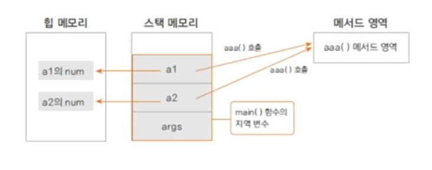

## 가상 메서드의 원리
- 가상 메서드 테이블에서 해당 메서드에 대한 address를 가지고 있습니다.
- 재정의된 경우는 재정의 된 메서드의 주소를 가리킵니다.

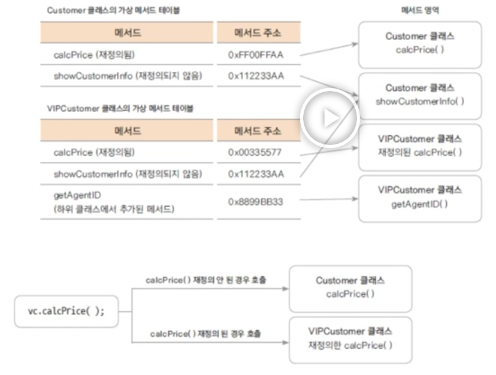

# 다형성과 다형성을 사용하는 이유
## 다형성이란?
- 하나의 코드가 여러 자료형으로 구현되어 실행되는 것입니다.
- 같은 코드에서 여러 다른 실행 결과가 나옵니다.
- 정보은닉, 상속과 더불어 객체지향 프로그래밍의 가장 큰 특징 중 하나입니다.
- 다형성을 잘 활용하면 유연하고 확장성있고, 유지보수가 편리한 프로그램을 만들 수 있습니다.

## 다형성의 예
```java
class Animal {
	 // 공통적으로 사용하는 메서드는 상위 클래스에 선언합니다.
   public void move() {
      System.out.println("동물이 움직입니다.");
   }
}

class Human extends Animal {

   @Override
   public void move() {
      System.out.println("사람이 걷습니다.");
   }
   
   public void readBook() {
      System.out.println("사람이 책을 읽습니다.");
   }
   
}

class Tiger extends Animal {

   @Override
   public void move() {
      System.out.println("호랑이가 네발로 뜁니다.");
   }
   
   public void hunting() {
      System.out.println("호랑이가 사냥을 합니다.");
   }
   
}

class Eagle extends Animal {

   @Override
   public void move() {
      System.out.println("독수리가 하늘을 날아 다닙니다.");
   }
   
   public void flying() {
      System.out.println("독수리가 양날개를 쭉 펴고 날아 다닙니다.");
   }
   
}

public class AnimalTest {

   public static void main(String[] args) {
      Animal h = new Human();
      Animal t = new Tiger();
      Animal e = new Eagle();
      
      AnimalTest test = new AnimalTest();
      test.moveAnimal(h);
      test.moveAnimal(e);
      test.moveAnimal(t);
			
			System.out.println("==============================");
			
			ArrayList<Animal> animalList = new ArrayList<>();
      animalList.add(h);
      animalList.add(e);
      animalList.add(t);
      
      for (Animal animal : animalList) {
         animal.move();
      }
   }
   
   public void moveAnimal(Animal animal) {
      animal.move();
   }

}
```

### 출력결과
```console
사람이 걷습니다.
독수리가 하늘을 날아 다닙니다.
호랑이가 네발로 뜁니다.
==============================
사람이 걷습니다.
독수리가 하늘을 날아 다닙니다.
호랑이가 네발로 뜁니다.
```

- 코드는 한 줄 인데 어떤 데이터형이 들어갔느냐에 따라(어떤 인스턴스형이 들어갔느냐에 따라) move()의 실행이 달라집니다. 이것이 다형성입니다.
- 상속을 하게 되면 하위 클래스들을 상위 클래스 하나의 타입으로 모두 핸들링 할 수 있습니다. 클래스간의 결합도가 굉장히 높아집니다.
- 하지만 상위 클래스를 바꾸면 하위 클래스에 영향을 미칠 수 있습니다. 그래서 상속을 설계할 때는 꼭 필요한 경우 신중하게 설계를 해야합니다.

## 다형성을 사용하는 이유?
- 다른 동물을 추가하는 경우
- 상속과 메서드 재정의를 활용하여 확장성 있는 프로그램을 만들 수 있습니다.
- 그렇지 않는 경우 많은 if-else if문이 구현되고 코드의 유지보수가 어려워 집니다.
- 상위 클래스에서는 공통적인 부분을 제공하고 하위 클래스에서는 각 클래스에 맞는 기능을 구현합니다.
- 여러 클래스를 하나의 타입(상위 클래스)으로 핸들링 할 수 있습니다.

## 다형성을 활용한 멤버쉽 프로그램 확장
- 일반 고객과 VIP 고객 중간 멤버쉽 만들기
```textarea
고객이 늘어 일반 고객보다는 많이 구매하고 VIP보다는 적게 구매하는 고객에게도 혜택을 주는 경우

GOLD 고객 등급을 만들고 혜택은 다음과 같습니다.
1. 제품을 살때는 10%를 할인해줍니다.
2. 보너스 포인트는 2%를 적립해줍니다.
```

### GoldCustomer.java
```java
public class GoldCustomer extends Customer {

   double salesRatio;
   
   public GoldCustomer(int customerID, String customerName) {
      super(customerID, customerName);
      
      salesRatio = 0.1;
      bonusRatio = 0.02;
      customerGrade = "Gold";
   }

   @Override
   public int calcPrice(int price) {
      bonusPoint += price * bonusRatio;
      return price - (int)(price * salesRatio);
   }
}
```

### CustomerTest.java(수정)
```java
ArrayList<Customer> customerList = new ArrayList<>();
Customer customerL = new Customer(10010, "Lim");
Customer customerT = new Customer(10020, "Tom");
Customer customerW = new GoldCustomer(10030, "Woo");
Customer customerK = new GoldCustomer(10040, "Kim");
Customer customerJ = new VIPCustomer(10050, "Jam");

customerList.add(customerJ);
customerList.add(customerK);
customerList.add(customerW);
customerList.add(customerT);
customerList.add(customerL);

for(Customer customer : customerList) {
	 System.out.println(customer.showCustomerInfo());
}

int price = 10000;

for(Customer customer : customerList) {
	 int cost = customer.calcPrice(price);
	 System.out.println(customer.getCustomerName() + "님이 " + cost + "원 지불하셨습니다.");
	 System.out.println(customer.getCustomerName() + "님의 현재 보너스 포인트는 " + customer.bonusPoint + "입니다.");
}
```

### 출력결과
```console
Jam님의 등급은 VIP이며, 보너스 포인트는 0입니다.
Kim님의 등급은 Gold이며, 보너스 포인트는 0입니다.
Woo님의 등급은 Gold이며, 보너스 포인트는 0입니다.
Tom님의 등급은 SILVER이며, 보너스 포인트는 0입니다.
Lim님의 등급은 SILVER이며, 보너스 포인트는 0입니다.
Jam님이 9000원 지불하셨습니다.
Jam님의 현재 보너스 포인트는 500입니다.
Kim님이 9000원 지불하셨습니다.
Kim님의 현재 보너스 포인트는 200입니다.
Woo님이 9000원 지불하셨습니다.
Woo님의 현재 보너스 포인트는 200입니다.
Tom님이 10000원 지불하셨습니다.
Tom님의 현재 보너스 포인트는 100입니다.
Lim님이 10000원 지불하셨습니다.
Lim님의 현재 보너스 포인트는 100입니다.
```

# 상속은 언제 사용하나
## IS-A관계(is a realationship : inheritance)
- 일반적인 개념과 구체적인 개념과의 관계
- 상위 클래스 : 하위 클래스보다 일반적인 개념(예 : Employee)
- 하위 클래스 : 상위 클래스보다 더 구체적인 개념(예 : Engineer, Manager, ...)
- 상속은 클래스간의 결합도가 높은 설계입니다.
- 상위 클래스의 수정이 많은 하위 클래스에 영향을 미칠 수 있습니다.
- 계층구조가 복잡하거나 계급(hierarchy)이 높으면 좋지 않습니다.

## HSA-A관계(composition)
- 클래스가 다른 클래스를 포함하는 관계(변수로 선언)입니다.
- 코드 재사용의 가장 일반적인 방법입니다.
- Student가 Subject를 포함하는 예제와 같은 경우입니다.
- Library를 구현할 때 ArrayList를 생성하여 사용하였습니다.
- 상속하지 않았습니다.

# 다운 캐스팅과 instanceof
## 다운캐스팅
- 업캐스팅된 클래스를 다시 원래의 타입으로 형 변환입니다.
- 하위 클래스로의 형 변환은 명시적으로 해야합니다.

```java
Customer vc = new VIPCustomer(); // 묵시적
VIPCustomer vCustomer = (VIPCustomer)vc; // 명시적
```

## instanceof를 이용하여 인스턴스의 형 체크
- 원래의 인스턴스의 형이 맞는지 여부를 체크하는 키워드입니다.
- 맞으면 true 아니면 false를 반환합니다.

### AnimalTest.java
```java
import java.util.ArrayList;

class Animal {
   // 공통적으로 사용하는 메서드는 상위 클래스에 선언합니다.
   public void move() {
      System.out.println("동물이 움직입니다.");
   }
}

class Human extends Animal {

   @Override
   public void move() {
      System.out.println("사람이 걷습니다.");
   }
   
   public void readBook() {
      System.out.println("사람이 책을 읽습니다.");
   }
   
}

class Tiger extends Animal {

   @Override
   public void move() {
      System.out.println("호랑이가 네발로 뜁니다.");
   }
   
   public void hunting() {
      System.out.println("호랑이가 사냥을 합니다.");
   }
   
}

class Eagle extends Animal {

   @Override
   public void move() {
      System.out.println("독수리가 하늘을 날아 다닙니다.");
   }
   
   public void flying() {
      System.out.println("독수리가 양날개를 쭉 펴고 날아 다닙니다.");
   }
   
}

public class AnimalTest {

   public static void main(String[] args) {
      Animal h = new Human();
      Animal t = new Tiger();
      Animal e = new Eagle();
      
      AnimalTest test = new AnimalTest();
      
      ArrayList<Animal> animalList = new ArrayList<>();
      animalList.add(h);
      animalList.add(e);
      animalList.add(t);
      
      for (Animal animal : animalList) {
         animal.move();
      }
      
      test.testDownCasting(animalList);
      
   }
   
   public void testDownCasting(ArrayList<Animal> list) {
      for(int i = 0; i< list.size(); i++) {
         Animal animal = list.get(i);
         
         if(animal instanceof Human) {
            Human human = (Human)animal;
            human.readBook();
         }
         else if(animal instanceof Tiger) {
            Tiger tiger = (Tiger)animal;
            tiger.hunting();
         }
         else if(animal instanceof Eagle) {
            Eagle eagle = (Eagle)animal;
            eagle.flying();
         }
         else {
            System.out.println("X");
         }
      }
   }
   
   public void moveAnimal(Animal animal) {
      animal.move();
   }
}
```

### 출력결과
```console
사람이 걷습니다.
독수리가 하늘을 날아 다닙니다.
호랑이가 네발로 뜁니다.
사람이 책을 읽습니다.
독수리가 양날개를 쭉 펴고 날아 다닙니다.
호랑이가 사냥을 합니다.
```

- 다운캐스팅을 사용하면 코드가 많이 지저분해지고 각 타입으로 다시 되돌려야하는 경우가 많이 있습니다.
- 다형성을 사용하는 방법이 더 좋지만 반드시 원래 타입으로 되돌여야하는 경우는 instanceof를 사용하여 확인한 다음에 하면 됩니다.

# 추상 클래스란?
- 구현 코드 없이 메서드의 선언만 있는 추상 메서드(abstract method)를 포함한 클래스입니다.
- 메서드 선언(declaration): 반환타입, 메서드 이름, 매개변수로 구성합니다.
- 메서드 정의(definition): 메서드 구현과 동일한 의미 구현부를 가집니다.
- 예시
	```java
	int add(int x, int y); // 선언
	int add(int x, int y){} // 구현부 o, 추상메서드 x
	```
- abstract 예약어를 사용합니다.
- 추상 클래스는 new할 수 없습니다.(인스턴스화 할 수 없습니다.)

## 추상클래스 구현하기
- 메서드에 구현 코드가 없으면 abstract로 선언합니다.
- abstract로 선언된 메서드를 가진 클래스는 abstract로 선언합니다.
- 모든 메서드가 구현된 클래스라도 abstract로 선언되면 추상클래스로 인스턴스화 할 수 없습니다.
- 추상 클래스의 추상메서드는 하위 클래스가 상속하여 구현합니다.
- 추상 클래스 내의 추상 메서드 : 하위 클래스가 구현해야 하는 메서드입니다.
- 추상 클래스 내의 구현된 메서드 : 하위 클래스가 공통으로 사용하는 메서드(필요에 따라 하위 클래스에서 재정의 합니다.)

### Computer.java
```java
public abstract class Computer {
   // 추상 클래스는 상속을 위한 클래스
   
   public abstract void display();
   public abstract void typing();
   
   public void turnOn() {
      System.out.println("전원을 켭니다.");
   }
   
   public void turnOff() {
      System.out.println("전원을 끕니다.");
   }
}
```

### Desktop.java
```java
public class Desktop extends Computer {

   // Desktop 클래스를 abstract를 사용하여 추상 클래스로 선언할 수 있습니다.
   // 하지만 추상 클래스로 선언하게 되면 이 클래스는 new를 할 수 없습니다.
   // 추상 클래스는 상속을 하기 위해서 만든 클래스입니다.
   // 추상 클래스안에 구현하는 메서드들은 일부는 구현을 할 수 있도 있고 일부는 구현을 안할 수도 있습니다. 어떤 경우는 다 안할 수도 있습니다.
   // 이 클래스는 상속만을 하기 위한 클래스입니다.
   
   @Override
   public void display() {
      System.out.println("Desktop display");      
   }

   @Override
   public void typing() {
      System.out.println("Desktop typing");
   }

   @Override
   public void turnOff() {
      System.out.println("Desktop turnOff");
   }
}
```

### NoteBook.java
```java
public abstract class NoteBook extends Computer{

   @Override
   public void display() {
      System.out.println("NoteBook display");
   }

}
```

### MyNoteBook.java
```java
public class MyNoteBook extends NoteBook {

   @Override
   public void typing() {
      System.out.println("MyNoteBook typing");
   }

}
```

### ComputerTest.java
```java
public class ComputerTest {

   public static void main(String[] args) {
      Computer desktop = new Desktop();
//    Computer computer = new Computer(); error
      
      desktop.display();
   }

}
```

# 추상 클래스의 응용 - 템플릿 메서드 패턴
## 템플릿 메서드
- 추상 메서드나 구현된 메서드를 활용하여 코드의 흐름(시나리오)을 정의하는 메서드입니다.
- final로 선언하여 하위 클래스에서 재정의 할 수 없게 합니다. (흐름을 가지고 있기 때문에)
- 프레임워크에서 많이 사용되는 설계 패턴
- 추상 클래스로 선언된 상위 클래스에서 템플릿 메서드를 활용하여 전체적인 흐름을 정의하고 하위 클래스에서 다르게 구현되어야 하는 부분은 추상 메서드로 선언하여 하위 클래스에서 구현 하도록 합니다.

**final 키워드가 변수로 쓰이면 상수, 메서드에 쓰이면 재정의를 못하는 메서드, 클래스에 쓰이면 상속이 안되는 클래스**

## 템플릿 메서드 예제
### Car.java
```java
public abstract class Car {
   public abstract void drive();
   public abstract void stop();
   public abstract void wiper();
   
   public void startCar() {
      System.out.println("시동을 켭니다.");
   }
   
   public void turnOff() {
      System.out.println("시동을 끕니다.");
   }
   
   public void washCar() {} // 추상메서드가 아니라 구현된 메서드인데 구현 내용이 없는 것. 필요한 경우 재정의를 하여 사용.
   
   final public void run() {
      startCar();
      drive();
      wiper();
      stop();
      turnOff();
      washCar();
   }
}
```

### AICar.java
```java
public class AICar extends Car {

   @Override
   public void drive() {
      System.out.println("자율 주행을 합니다.");
      System.out.println("자동차가 스스로 방향을 바꿉니다.");
   }

   @Override
   public void stop() {
      System.out.println("장애물 앞으로 스스로 멈춥니다.");
   }

   @Override
   public void wiper() {
      
   }

   @Override
   public void washCar() { // 훅메서드. 필요한 경우에 상위 클래스에서 써놓은 메서드를 재정의해서 사용.
      System.out.println("자동 세차를 합니다.");
   }
}
```

### ManualCar.java
```java
public class ManualCar extends Car {

   @Override
   public void drive() {
      System.out.println("사람이 운전합니다.");
      System.out.println("사람이 핸들을 조작합니다.");
   }

   @Override
   public void stop() {
      System.out.println("장애물 앞에서 브레이크를 밟아서 정지합니다.");
   }

   @Override
   public void wiper() { }

}
```

### CarTest.java
```java
public class CarTest {

   public static void main(String[] args) {
      Car aiCar = new AICar();
      aiCar.run();
      
      System.out.println("===================");
      
      Car mCar = new ManualCar();
      mCar.run();
   }
}
```

### 출력결과
```console
시동을 켭니다.
자율 주행을 합니다.
자동차가 스스로 방향을 바꿉니다.
장애물 앞으로 스스로 멈춥니다.
시동을 끕니다.
자동 세차를 합니다.
===================
시동을 켭니다.
사람이 운전합니다.
사람이 핸들을 조작합니다.
장애물 앞에서 브레이크를 밟아서 정지합니다.
시동을 끕니다.
```

## final예약어
- final 변수 : 값이 변경될 수 없는 상수
```java
public static final double PI = 3.14;
```
- final메서드 : 하위 클래스에서 재정의할 수 없는 메서드
- final클래스 : 상속할 수 없는 클래스

## 여러 자바 파일에서 사용하는 상수 값 정의
### Define.java
```java
public class Define {
	public static final int MIN = 1;
	public static final int MAX = 999999;
	public static final double PI = 3.14;
	public static final String GREETING = "Good Morning";
	public static final int MATH_CODE = 1001;
	public static final int CHEMISTRY_CODE = 1002;
}
```
### UsingDefine.java
```java
public class UsingDefine {
	public static void main(String[] args) {
		System.out.println(Define.GREETING);
		System.out.println(Define.MIN);
		System.out.println(Define.MAX);
		System.out.println(Define.MATH_CODE);
		System.out.println(Define.CHEMISTRY_CODE);
		System.out.println("원주율은 " + Define.PI + "입니다.");
 }
}
```

# 인터페이스(interface)
## 인터페이스란?
- 모든 메서드가 추상 메서드로 선언됩니다. public abstract
- 모든 변수는 상수로 선언됩니다.

```java
interface 인터페이스 이름 {
	public static final float pi = 3.14F;
	public void makeSomething();
}
```
- 자바8 부터 디폴트 메서드(default method)와 정적 메서드(static method)기능의 제공으로 일부 구현 코드가 있습니다.

## 인터페이스 정의와 구현하기
선언된 메서드들은 당연히 구현코드가 없습니다.

### Calc.java
```java
public interface Calc {
   double PI = 3.14;
   int ERROR = -9999999;
   
   int add(int num1, int num2);
   int substract(int num1, int num2);
   int times(int num1, int num2);
   int divide(int num1, int num2);
}
```

### Calculator.java
```java
public abstract class Calculator implements Calc {

//   4개의 메서드를 다 구현하지 않기 때문에 abstract가 되어야 합니다.
   @Override
   public int add(int num1, int num2) {
      return num1 + num2;
   }
   @Override
   public int substract(int num1, int num2) {
      return num1 - num2;
   }
}
```

### CompleteCalc.java
```java
public class CompleteCalc extends Calculator {

   @Override
   public int times(int num1, int num2) {
      return num1 * num2;
   }

   @Override
   public int divide(int num1, int num2) {
      if(num2 == 0) {
         return ERROR;
      }
      return num1 / num2;
   }
   
   public void showInfo() {
      System.out.println("모두 구현");
   }

}
```

### CalculatorTest.java
```java
public class CalculatorTest {

   public static void main(String[] args) {
      
      int n1 = 10;
      int n2 = 2;
      
      Calc calc = new CompleteCalc();
      
      System.out.println(calc.add(n1, n2));
      System.out.println(calc.substract(n1, n2));
      System.out.println(calc.times(n1, n2));
      System.out.println(calc.divide(n1, n2));
   }

}
```

### 출력결과
```console
12
8
20
5
```

## 인터페이스 구현과 형 변환
- 인터페이스를 구현한 클래스는 인터페이스 형으로 선언한 변수로 형 변환할 수 있습니다.
```java
Calc calc = new CompleteCalc();
```
- 상속에서의 형 변환과 동일한 의미입니다.
- 클래스 상속과 달리 구현코드가 없으므로 여러 인터페이스를 구현할 수 있습니다. (cf. extends)
- 형 변환되는 경우 인터페이스에 선언된 메서드만을 사용가능합니다.

# 인터페이스를 사용하는 이유
## 인터페이스가 하는 일
- 클래스나 프로그램이 제공하는 기능을 명시적으로 선언합니다.
- 일종의 클라이언트 코드와의 약속이며 클래스나 프로그램이 제고앟는 명세입니다.
- 클라이언트 프로그램은 인터페이스에 선언된 메서드 명세만 보고 이를 구현한 클래스를 사용할 수 있습니다.
- 어떤 객체가 하나의 인터페이스 타입이라는 것은 그 인터페이스가 제공하는 모든 메서드를 구현했다는 의미입니다.
- 인터페이스를 구현한 다양한 객체를 사용합니다. (다형성)
- 예) JDBC 인터페이스

# 인터페이스를 활용한 다형성 구현 (dao 구현하기)
## 인터페이스와 다형성
하나의 인터페이스를 여러 객체가 구현하게되면 클라이언트 프로그램은 인터페이스의 메서드를 활용하여 여러 객체의 구현을 사용할 수 있습니다. (다형성)

## 인터페이스를 활용한 dao구현하기
- DB에 회원 정보를 넣는 dao(data access object)를 여러 DB제품이 지원될 수 있게 구현합니다.
- 환경파일(db.properties)에서 DB의 종류에 대한 정보를 읽고 그 정보에 맞게 dao인스턴스를 생성하여 실행될 수 있게 합니다.

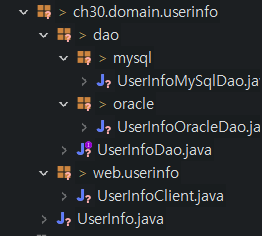

### UserInfo.java
```java
package ch30.domain.userinfo;

public class UserInfo {
	private String userID;
	private String userPW;
	private String userName;
	
	
	public String getUserID() {
		return userID;
	}
	public void setUserID(String userID) {
		this.userID = userID;
	}
	public String getUserPW() {
		return userPW;
	}
	public void setUserPW(String userPW) {
		this.userPW = userPW;
	}
	public String getUserName() {
		return userName;
	}
	public void setUserName(String userName) {
		this.userName = userName;
	}
}
```

### UserInfoDao.java
```java
package ch30.domain.userinfo.dao;

import ch30.domain.userinfo.UserInfo;

public interface UserInfoDao {
	void insertUserInfo(UserInfo userinfo);
	void updateUserInfo(UserInfo userinfo);
	void deleteUserInfo(UserInfo userinfo);
}
```

### UserInfoMySqlDao.java
```java
package ch30.domain.userinfo.dao.mysql;

import ch30.domain.userinfo.UserInfo;
import ch30.domain.userinfo.dao.UserInfoDao;

public class UserInfoMySqlDao implements UserInfoDao {

	@Override
	public void insertUserInfo(UserInfo userinfo) {
		System.out.println("Insert into MySQL DB userID = " + userinfo.getUserID());
	}

	@Override
	public void updateUserInfo(UserInfo userinfo) {
		System.out.println("Update into MySQL DB userID = " + userinfo.getUserID());
	}

	@Override
	public void deleteUserInfo(UserInfo userinfo) {
		System.out.println("Delete from MySQL DB userID = " + userinfo.getUserID());
	}

}
```

### UserInfoOracleDao.java
```java
package ch30.domain.userinfo.dao.oracle;

import ch30.domain.userinfo.UserInfo;
import ch30.domain.userinfo.dao.UserInfoDao;

public class UserInfoOracleDao implements UserInfoDao {

	@Override
	public void insertUserInfo(UserInfo userinfo) {
		System.out.println("Insert into Oracle DB userID = " + userinfo.getUserID());
	}

	@Override
	public void updateUserInfo(UserInfo userinfo) {
		System.out.println("Update into Oracle DB userID = " + userinfo.getUserID());
	}

	@Override
	public void deleteUserInfo(UserInfo userinfo) {
		System.out.println("Delete from Oracle DB userID = " + userinfo.getUserID());
	}

}
```

### UserInfoClient.java
```java
package ch30.domain.userinfo.web.userinfo;

import java.io.FileInputStream;
import java.io.IOException;
import java.util.Properties;

import ch30.domain.userinfo.UserInfo;
import ch30.domain.userinfo.dao.UserInfoDao;
import ch30.domain.userinfo.dao.mysql.UserInfoMySqlDao;
import ch30.domain.userinfo.dao.oracle.UserInfoOracleDao;

public class UserInfoClient {

	public static void main(String[] args) throws IOException {
		
		FileInputStream fis = new FileInputStream("db.properties");
		
		Properties prop = new Properties();
		prop.load(fis);
		
		String dbType = prop.getProperty("DBTYPE");
		
		UserInfo userInfo = new UserInfo();
		userInfo.setUserID("12345");
		userInfo.setUserPW("54321");
		userInfo.setUserName("SJ");
		
		UserInfoDao userInfoDao = null;
		
		if(dbType.equals("ORACLE")) {
			userInfoDao = new UserInfoOracleDao();
		}
		else if (dbType.equals("MYSQL")) {
			userInfoDao = new UserInfoMySqlDao();
		}
		else {
			System.out.println("db error");
			return;
		}
		
		userInfoDao.insertUserInfo(userInfo);
		userInfoDao.updateUserInfo(userInfo);
		userInfoDao.deleteUserInfo(userInfo);
	}

}
```

### db.properites (프로젝트 안에 파일 생성)
```textarea
DBTYPE=ORACLE
```

# 인터페이스의 여러가지 요소
## 상수
- 모든 변수는 상수로 변환됩니다. (public static final)

```java
double PI = 3.14;
int ERROR = -999999;
```

## 추상 메서드
- 모든 선언된 메서드는 추상 메서드 (public abstract)

## 디폴트 메서드 (자바 8이후)
- 구현을 가지는 메서드, 인터페이스를 구현하는 클래스들에서 공통으로 사용할 수 있는 기본 메서드입니다.
- default 키워드를 사용합니다.

```java
default void description() {
	System.out.println("정수 계산기를 구현합니다.");
	myMethod();
}
```

- 구현하는 클래스에서 재정의 할 수 있습니다.

```java
@Override
public void description() {
	System.out.println("CompleteCalc에서 재정의한 default 메서드");
	// super.description();
}
```
- 인터페이스를 구현한 클래스의 인스턴스가 생성되어야 사용 가능합니다.

## 정적 메서드 (자바 8이후)
- 인스턴스 생성과 상관없이 인터페이스 타입으로 사용할 수 있는 메서드입니다.

```java
static int total(int[] arr) {
	int total = 0;
	
	for(int i: arr) {
		total += i;
	}
	
	mystaticMethod();
	return total;
}
```

## private 메서드 (자바 9이후)
- 인터페이스를 구현한 클래스에서 사용하거나 재정의할 수 없습니다.
- 인터페이스 내부에서만 사용하기 위해 구현하는 메서드입니다.
- default 메서드나 static메서드에서 사용합니다.

```java
private void myMethod() {
	System.out.println("private method");
}


private static void myStaticMethod() {
	System.out.println("private static method");
}
```

# 여러 인터페이스 구현하기, 인터페이스의 상속
## 여러 인터페이스 구현
- 자바의 인터페이스는 구현 코드가 없으므로 하나의 클래스가 여러 인터페이스를 구현할 수 있습니다. (자바에서 클래스는 다중 상속이 가능하지 않습니다. - Diamond Problem)
- 디폴트 메서드가 중복되는 경우는 구현하는 클래스에서 재정의 하여야 합니다.
- 여러 인터페이스를 구현한 클래스는 인터페이스 타입으로 형 변환되는 경우 해당 인터페이스에 선언된 메서드만 사용 가능 합니다.

### Buy.java
```java
public interface Buy {
	void buy();
	
	default void order() {
		System.out.println("buy order");
	}
}
```

### Sell.java
```java
public interface Sell {
	void sell();
	
	default void order() {
		System.out.println("sell order");
	}
}
```

### Customer.java
```java
public class Customer implements Buy, Sell {

	@Override
	public void sell() {
		System.out.println("customer sell");
	}

	@Override
	public void buy() {
		System.out.println("customer buy");
	}

	@Override
	public void order() {
		System.out.println("customer order");
	}

	public void hello() {
		System.out.println("hello");
	}
}
```

### CustomerTest.java
```java
public class CustomerTest {

	public static void main(String[] args) {
		Customer customer = new Customer();
		
		customer.buy();
		customer.sell();
		customer.order();
		customer.hello();
		
		Buy buyer = customer;
		buyer.buy();
		buyer.order();
		
		Sell seller = customer;
		seller.sell();
		seller.order();
		
	}
}
```

### 출력결과
```console
customer buy
customer sell
customer order
hello
customer buy
customer order
customer sell
customer order
```

## 인터페이스의 상속
- 인터페이스 사이에도 상속을 사용할 수 있습니다.
- extends 키워드를 사용합니다.
- 인터페이스는 다중 상속이 가능하고 구현 코드의 상속이 아니므로 타입 상속이라고 합니다.

### X.java
```java
public interface X {
	void x();
}
```

### Y.java
```java
public interface Y {
	void y();
}
```

### MyInterface.java
```java
public interface MyInterface extends X, Y { // void x()와 void y()를 모두 선언하겠다는 의미
	void myMethod();
}
```

### MyClass.java
```java
public class MyClass implements MyInterface {
	@Override
	public void x() {
		System.out.println("x()");
	}
	
	@Override
	public void y() {
		System.out.println("y()");
	}
	
	@Override
	public void myMethod() {
		System.out.println("myMethod()");
	}
}
```

### MyClassTest.java
```java
public class MyClassTest {
	public static void main(String[] args) {
		MyClass mClass = new MyClass();
		
		X xClass = mClass;
		xClass.x();
		
		Y yClass = mClass;
		yClass.y();
		
		MyClass iClass = mClass;
		iClass.x();
		iClass.y();
		iClass.myMethod();
		
	}
}
```

## 클래스 상속과 인터페이스 구현 함께 쓰기
- 실무에서 프레임워크나 오픈소스와 함께 연동되는 구현을 하게 되면 클래스 상속과 인터페이스의 구현을 같이 사용하는 경우가 많습니다.

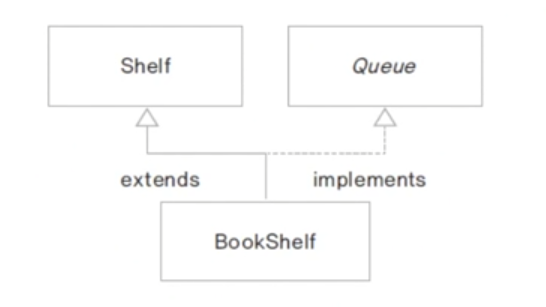

- 책이 순서대로 대여가 되는 도서관 구현
- 책을 보관하는 자료 구조가 Shelf에 구현됩니다. (ArrayList)
- Queue 인터페이스를 구현합니다. (FIFO)
- Shelf 클래스를 상속받고 Queue를 구현합니다.

### Shelf.java
```java
import java.util.ArrayList;

public class Shelf {
	protected ArrayList<String> shelf;
	
	public Shelf() {
		shelf = new ArrayList<>();
	}
	
	public ArrayList<String> getShelf() {
		return shelf;
	}
	
	public int getCount() {
		return shelf.size();
	}
}
```

### Queue.java
```java
public interface Queue {
	void enQueue(String title);
	String deQueue();
	
	int getSize();
}
```

### BookShelf.java
```java
public class BookShelf extends Shelf implements Queue {

	@Override
	public void enQueue(String title) {
		shelf.add(title);
	}

	@Override
	public String deQueue() {
		return shelf.remove(0);
	}

	@Override
	public int getSize() {
		return getCount();
	}

}
```

### BookShelfTest.java
```java
public class BookShelfTest {

	public static void main(String[] args) {
		Queue bookQueue = new BookShelf();
		
		bookQueue.enQueue("책 1");
		bookQueue.enQueue("책 2");
		bookQueue.enQueue("책 3");
		bookQueue.enQueue("책 4");
		bookQueue.enQueue("책 5");
		
		System.out.println(bookQueue.getSize());
		System.out.println(bookQueue.deQueue());
		System.out.println(bookQueue.deQueue());
		System.out.println(bookQueue.deQueue());
		System.out.println(bookQueue.deQueue());
		System.out.println(bookQueue.deQueue());
	}

}
```

### 출력 결과
```java
5
책 1
책 2
책 3
책 4
책 5
```

# Review
## 추상 클래스와 템플릿 메서드
```textarea
Player가 있고 Player는 GameLevel 속성을 가집니다. 각 GameLevel 단계마다 run(), jump(), turn() 세 가지 기능이 업그레이드 됩니다.
초보자 레벨 : 천천히 달립니다. run()만 가능
중급자 레벨 : 빠르게 달리고 점프할 수 있습니다. run(), jump() 가능
고급자 레벨 : 엄청 빠르게 달리고 높게 점프하고 턴할 수 있습니다. run(), jump(), turn() 가능

Player는 한번에 하나의 레벨 상태만을 가질 수 있습니다.

Player가 play() 중에 레벨에 있는 go(int count)라는 메서드를 호출하면 run()하고 count() 횟수만큼 jump()하고 turn()합니다.
다음 클래스 다이어그램을 참고하여 각 레벨에서 go()가 호출 될 때 다음과 같이 출력되도록 하세요.
```

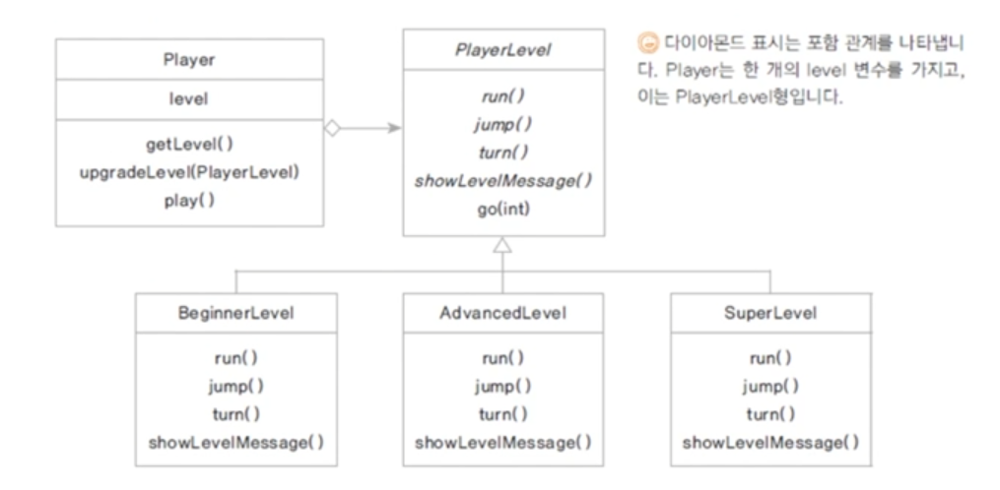

### Player.java
```java
public class Player {
	private PlayerLevel level; // 보안을 위해 private로 선언
	
	public Player() { // 초기 레벨 설정
		level = new BeginnerLevel();
		level.showLevelMessage();
	}
	
	public PlayerLevel getLevel() {
		return level;
	}

	public void play(int i) {
		level.go(i);
	}

	public void upgradeLevel(PlayerLevel level) {
		this.level = level; // 현재 level에 main에서 생성한 생성자가 upgradeLevel메서드를 호출하고 매개변수값을 받아서 그 변수값을 대입한다.
		level.showLevelMessage();
	}
}
```

### PlayerLevel.java
```java
public abstract class PlayerLevel {
	public abstract void run();
	
	public abstract void jump();
	
	public abstract void turn();
	
	public abstract void showLevelMessage();
	
	final void go(int count) {
		run();
		for(int i = 0; i < count; i++) {
			jump();
		}
		turn();
	}
}
```

### BeginnerLevel.java
```java
public class BeginnerLevel extends PlayerLevel {

	@Override
	public void run() {
		System.out.println("천천히 달립니다.");
	}

	@Override
	public void jump() {
		System.out.println("못합니다.");
		
	}

	@Override
	public void turn() {
		System.out.println("못합니다.");
	}

	@Override
	public void showLevelMessage() {
		System.out.println("===== 초급자 레벨 =====");
	}

}
```

### AdvancedLevel.java
```java
public class AdvancedLevel extends PlayerLevel {

	@Override
	public void run() {
		System.out.println("빨리 달립니다.");
	}

	@Override
	public void jump() {
		System.out.println("높이 jump 합니다.");
	}

	@Override
	public void turn() {
		System.out.println("못합니다.");
	}

	@Override
	public void showLevelMessage() {
		System.out.println("===== 중급자 레벨 =====");
	}

}
```

### SuperLevel.java
```java
public class SuperLevel extends PlayerLevel {

	@Override
	public void run() {
		System.out.println("엄청 빨리 달립니다.");
	}

	@Override
	public void jump() {
		System.out.println("높이 jump합니다.");
	}

	@Override
	public void turn() {
		System.out.println("turn 합니다.");
	}

	@Override
	public void showLevelMessage() {
		System.out.println("===== 상급자 레벨 =====");
	}

}
```

### MainBoard.java
```java
public class MainBoard {

	public static void main(String[] args) {
		Player player = new Player();
		
		player.play(1);
		
		AdvancedLevel aLevel = new AdvancedLevel();
		player.upgradeLevel(aLevel);
		player.play(2);
		
		SuperLevel sLevel = new SuperLevel();
		player.upgradeLevel(sLevel);
		player.play(3);
		
	}

}
```

### 출력결과
```console
===== 초급자 레벨 =====
천천히 달립니다.
못합니다.
못합니다.
===== 중급자 레벨 =====
빨리 달립니다.
높이 jump 합니다.
높이 jump 합니다.
못합니다.
===== 상급자 레벨 =====
엄청 빨리 달립니다.
높이 jump합니다.
높이 jump합니다.
높이 jump합니다.
turn 합니다.
```

## 인터페이스를 활용한 정책 프로그래밍
```textarea
고객 센터에 전화 상담을 하는 상담원들이 있습니다. 일단 고객에게서 전화가 오면 대기열에 저장되고 각 상담원에게 배분됩니다.
배분이 되는 정책은 크게 세 가지가 있습니다.
	1. 모든 상담원이 동일한 상담 건수를 처리하도록 상담원 순서대로 배분합니다.
	2. 쉬고 있거나 상담원에게 할당된 통화 수가 가장 적은 상담원에게 배분합니다.
	3. 고객의 등급에 따라 등급이 높은 고객은 업무 능력이 우수한 상담원에게 배분합니다.
세 가지 정책은 필요에 따라 바뀌어 운영될 수 있습니다. 다음 클래스 다이어드램을 참고하여 각 배분 규칙이 적용되도록 구현해 보세요
```

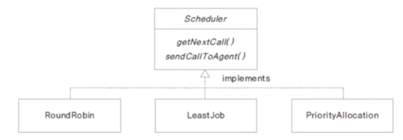

테스트 프로그램은 문자를 입력받아 입력되는 문자에 따라 배분 규칙을 수행하도록 합니다.
### SchedulerTest.java
```java
import java.io.IOException;

public class SchedulerTest {

	public static void main(String[] args) throws IOException {
		System.out.println("전화 상담원 할당 방식을 선택하세요.");
		System.out.println("R : 한명씩 차례대로");
		System.out.println("L : 대기가 적은 상담원 우선");
		System.out.println("P : 우선순위가 높은 고객 우선 숙련도 높은 상담원");
		
		int ch = System.in.read();
		
		Scheduler scheduler = null;
		
		if (ch == 'R' || ch == 'r') {
			scheduler = new RoundRobin();
		}
		else if (ch == 'L' || ch == 'l') {
			scheduler = new LeastJob();
		}
		else if (ch == 'P' || ch == 'p') {
			scheduler = new PriorityAllocation();
		}
		else {
			System.out.println("잘못입력하셨습니다.");
			return;
		}
		
		scheduler.getNextCall();
		scheduler.sendCallToAgent();
	}

}
```

### Scheduler.java
```java
public interface Scheduler {

	void getNextCall();

	void sendCallToAgent();

}
```

### RoundRobin.java
```java
public class RoundRobin implements Scheduler {

	@Override
	public void getNextCall() {
		System.out.println("상담전화를 순서대로 대기열에서 가져옵니다.");
	}

	@Override
	public void sendCallToAgent() {
		System.out.println("다음순서의 상담원에게 배분합니다.");
	}

}
```

### LeastJob.java
```java
public class LeastJob implements Scheduler {

	@Override
	public void getNextCall() {
		System.out.println("상담전화를 대기가 적은 상담원에게 배분합니다.");
	}

	@Override
	public void sendCallToAgent() {
		System.out.println("대기가 적은 상담원에게 배분합니다.");
	}

}
```

### PriorityAllocation.java
```java
public class PriorityAllocation implements Scheduler {

	@Override
	public void getNextCall() {
		System.out.println("상담전화를 우선순위가 높은 고객순서대로 대기열에서 가져옵니다.");
	}

	@Override
	public void sendCallToAgent() {
		System.out.println("숙련도 높은 상담원에게 배분합니다.");
	}

}
```

### 출력결과
```console
전화 상담원 할당 방식을 선택하세요.
R : 한명씩 차례대로
L : 대기가 적은 상담원 우선
P : 우선순위가 높은 고객 우선 숙련도 높은 상담원
l
상담전화를 대기가 적은 상담원에게 배분합니다.
대기가 적은 상담원에게 배분합니다.
```

# JavaStudy 4차
# Object 클래스 - 모든 클래스의 최상위 클래스
## java.lang 패키지
- 프로그래밍 시 import하지 않아도 자동으로 import됩니다.
- import.java.lang.*;
- 많이 사용하는 기본 클래스들이 속한 패키지
- String, Integer, System, ...

## 모든 클래스는 Object클래스를 상속 받습니다.
- java.lang.Object클래스
- 모든 클래스의 최상위 클래스
- 모든 클래스는 Object에서 상속받고, Object 클래스의 메서드 중 일부는 재정의해서 사용할 수 있습니다.
- 컴파일러가 extends Object를 추가합니다.

class Student => class Student extends Object

## toString() 메서드
- 객체의 정보를 String으로 바꾸어서 사용할 때 쓰입니다.
- String이나 Integer 클래스는 이미 재정의 되어 있습니다.

```java
class Book {
	private String title;
	private String author;
	
	public Book(String title, String author) {
		this.title = title;
		this.author = author;
	}

	@Override
	public String toString() {
		return title + "," + author;
	}
}

public class BookTest {

	public static void main(String[] args) {
		Book book = new Book("책 1", "SJ");
		
		System.out.println(book); // ch33.Book@7de26db8 -> toString() 메서드를 사용하면 입력한 값이 출력됩니다.
		
		String str = new String("test");
		System.out.println(str); // test
	}

}
```

### toString을 사용하지 않은 출력결과
```console
ch33.Book@7de26db8
test
```

### toString()을 사용한 출력결과
```console
책 1,SJ
test
```

# Object 클래스의 메서드 활용
## equals() 메서드
- 두 인스턴스의 주소값을 비교하여 true / false를 반환합니다.
- 재정의하여 두 인스턴스가 논리적으로 동일함의 여부를 구현합니다.
- 인스턴스가 다르더라도 논리적으로 동일한 경우 true를 반환하도록 재정의할 수 있습니다. (같은 학번, 같은 사번, 같은 아이디의 회원, ...)

## hashCode() 메서드
- hashCode()는 인스턴스의 저장 주소를 반환합니다.
- 힙 메모리에 인스턴스가 저장되는 방식이 hash방식입니다.
- hash : 정보를 저장, 검색하는 자료구조입니다.
- 자료의 특정 값(키 값)에 대한 저장 위치를 반환해주는 hash함수를 사용합니다.

```java
public class Student {
	private int studentNum;
	private String studentName;
	
	public Student(int studentNum, String studentName) {
		this.studentNum = studentNum;
		this.studentName = studentName;
	}
	
	public String toString() {
		return studentNum + "," + studentName;
	}
	
	@Override
	public boolean equals(Object obj) {
		if(obj instanceof Student) {
			Student std = (Student)obj;
			if(this.studentNum == std.studentNum) {
				return true;
			}
			else {
				return false;
			}
		}
		
		return false;
	}

	@Override
	public int hashCode() {
		return studentNum; // 이렇게 해주면 원래는 다른 값이 나오는데 같은 값이 나오게 됩니다.
	}
}
```

```java
public class EqualsTest {

	public static void main(String[] args) {
		Student std1 = new Student(100, "SJ");
		Student std2 = new Student(100, "SJ");
		Student std3 = std1;
		
		System.out.println(std1 == std2); // false
		System.out.println(std1 == std3); // true
		
		System.out.println(std1.equals(std2)); // false이지만 Student에서 주소는 다르지만 논리적으로 같다는 것을 재정의해주면 true가 출력됩니다.
		
		System.out.println(std1.hashCode());
		System.out.println(std2.hashCode());
		
		// 다른값이 나옵니다.
		System.out.println(System.identityHashCode(std1));
		System.out.println(System.identityHashCode(std2));
		
		String str1 = new String("abc");
		String str2 = new String("abc");
		
		System.out.println(str1.equals(str2)); // true
		
		System.out.println(str1.hashCode());
		System.out.println(str2.hashCode());
		
		Integer i = 100;
		System.out.println(i.hashCode()); // 100
	}

}
```

### 출력결과
```console
false
true
true
100
100
2111991224
292938459
true
96354
96354
100
```

## clone()
- 객체의 원본을 복제하는데 사용하는 메서드입니다.
- 생성과정의 복잡한 과정을 반복하지않고 복제할 수 있습니다.
- clone()메서드를 사용하면 객체의 정보(멤버변수 값등 ... )가 동일한 또 다른 인스턴스가 생성되는 것이므로, 객체 지향 프로그램에서의 정보은닉, 객체 보호의 관점에서 위배될 수 있습니다.
- 해당 클래스의 clone()메서드의 사용을 허용한다는 의미로 cloneable 인터페이스를 명시해 줍니다.

### Student.java
```java
public class Student implements Cloneable {
	private int studentNum;
	private String studentName;
	
	public Student(int studentNum, String studentName) {
		this.studentNum = studentNum;
		this.studentName = studentName;
	}
	
	public void setStudentName(String name) {
		this.studentName = name;
	}
	
	public String toString() {
		return studentNum + "," + studentName;
	}
	
	@Override
	public boolean equals(Object obj) {
		if(obj instanceof Student) {
			Student std = (Student)obj;
			if(this.studentNum == std.studentNum) {
				return true;
			}
			else {
				return false;
			}
		}
		
		return false;
	}

	@Override
	protected Object clone() throws CloneNotSupportedException {
		// TODO Auto-generated method stub
		return super.clone();
	}

	@Override
	public int hashCode() {
		return studentNum; // 이렇게 해주면 원래는 다른 값이 나오는데 같은 값이 나오게 됩니다.
	}
}
```

### EualsTest.java
```java
public class EqualsTest {

	public static void main(String[] args) throws CloneNotSupportedException {
		Student std1 = new Student(100, "SJ");
		Student std2 = new Student(100, "SJ");
		Student std3 = std1;
		
		System.out.println(std1 == std2); // false
		System.out.println(std1 == std3); // true
		
		System.out.println(std1.equals(std2)); // false이지만 Student에서 주소는 다르지만 논리적으로 같다는 것을 재정의해주면 true가 출력됩니다.
		
		System.out.println(std1.hashCode());
		System.out.println(std2.hashCode());
		
//	다른값이 나옵니다.
		System.out.println(System.identityHashCode(std1));
		System.out.println(System.identityHashCode(std2));
		
		
		std1.setStudentName("Woo");
		Student copyStudent = (Student)std1.clone();
		System.out.println(copyStudent);
	}

}
```

### 출력결과
```console
false
true
true
100
100
2111991224
292938459
100,Woo
```


# String, StringBuilder, StringBuffer 클래스, text block
## String 클래스
- String 선언하기

```java
String str1 = new String("abc"); // 힙 메모리에 생성
String str2 = "abc"; // 상수 풀에 생성. 상수 풀에 abc라는 string이 있고 그거에 주소만 가리키는 것.

// 즉 위의 두 개의 인스턴스는 다른 것이다.
```
- 힙 메모리에 인스턴스로 생성되는 경우와 상수 풀(constant pool)에 있는 주소를 참조하는 두 가지 방법이 있습니다.
- 힙 메모리는 생성될때마다 다른 주소 값을 가지지만, 상수 풀의 문자열은 모두 같은 주소 값을 가집니다.

```java
String str1 = new String("abc");
String str2 = new String("abc");

System.out.println(str1 == str2); // false. 힙에 따로 잡힘.

String str3 = "abc";
String str4 = "abc";

System.out.println(str3 == str4); // true. 상수 풀에 있는 것을 가리키는 것.
```

- 한번 생성된 String은 불변(immutable)
- String을 연결하면 기존의 String에 연결되는 것이 아닌 새로운 문자열이 생성됩니다. (메모리 낭비가 발생할 수도 있습니다.)

### StringTest
```java
public class StringTest {

	public static void main(String[] args) {
		String java = new String("java");
		String android = new String("android");
		
		// String클래스를 new해서 생성하게되면 Character 배열안에 들어가게 됨.
		// final로 선언됨. 즉, 해당 String은 변할 수 없다.
		// 상수 값도 변할 수 없다.
		
		System.out.println(System.identityHashCode(java));
		java = java.concat(android);
		
		System.out.println(java);
		
		System.out.println(System.identityHashCode(java));
	}

}
```

### 출력결과
```console
305808283
javaandroid
2111991224
```

## StringBuilder, StringBuffer 활용하기
- 내부적으로 가변적인 char[]를 멤버변수로 가집니다.
- 문자열을 여러번 연결하거나 변경할 때 사용하면 유용합니다.
- 새로운 인스턴스를 생성하지 않고 char[]를 변경합니다.
- StringBuffer는 멀티 쓰레드 프로그래밍에서 동기화(synchronization)를 보장합니다. (두개 이상의 쓰레드가 같은 메모리를 접근할 때 순서가 정해집니다.)
- 단일 쓰레드 프로그램에서는 StringBuilder 사용을 권장합니다.
- toString() 메서드로 String을 반환합니다.

### StringBuilderTest.java
```java
public class StringBuilderTest {

	public static void main(String[] args) {
		String java = new String("java");
		String android = new String("android");
		
		StringBuilder buffer = new StringBuilder(java);
		System.out.println(System.identityHashCode(java));
		
		buffer.append(android);
		System.out.println(System.identityHashCode(java));
		
		String test = buffer.toString();
		System.out.println(test);
	}

}
```

### 출력결과
```console
305808283
305808283
javaandroid
```

## text block 사용하기(java 13)
- 문자열 """ """ 사이에 이어서 만들 수 있습니다.
- html, json 문자열을 만드는데 유용하게 사용할 수 있습니다.

### TextBlockTest.java
```java
public class TextBlockTest {

	public static void main(String[] args) {
		String textBlocks = """
				Hello,
				hi,
				how r u
				""";
		
		System.out.println(textBlocks);
		System.out.println(getBlockOfHtml());
	}
	
	public static String getBlockOfHtml() {
		return """
				<html>
					<body>
						<span>example text</span>
					</body>
				</html>
				""";
	}

}
```
### 출력결과
```console
Hello,
hi,
how r u

<html>
	<body>
		<span>example text</span>
	</body>
</html>
```

# Class 클래스 사용하기
## Class 클래스
- 자바의 모든 클래스와 인터페이스는 컴파일 후 class 파일이 생성됩니다.
- CLass 클래스는 컴파일 된 class 파일을 로드하여 객체를 동적 로드하고, 정보를 가져오는 메서드가 제공됩니다.
- Class.forName("클래스 이름") 메서드로 클래스를 동적으로 로드합니다.

```java
Class c = Class.forName("java.lang.String");
```
- 클래스 이름으로 직접 Class 클래스 가져오기

```java
Class c = String.class;
```
- 생성된 인스턴스에서 Class 클래스 가져오기

```java
String s = new String();
Class c = s.getClass(); // Object 메서드
```

## 동적 로딩
- 컴파일 시에 데이터 타입이 binding 되는 것이 아닌, 실행(runtime)중에 데이터 타입을 binding 하는 방법이 있습니다.
- 프로그래밍 시에는 문자열 변수로 처리했다가 런타임시에 원하는 클래스를 로딩하여 binding할 수 있다는 장점이 있습니다.
- 컴파일 시에 타입 감지가 되지 않아서 만약 런타임 때 불렀는데 라이브러리나 클래스가 로컬에 없거나 스펠링이 틀리다면 시스템이 다운될 수도 있다는 단점이 있습니다.
- 컴파일 시에 타입이 정해지지 않으므로 동적 로딩시 오류가 발생하면 프로그램의 심각한 장애가 발생 가능합니다.

## Class의 newInstance()메서드로 인스턴스 생성
- new 키워드를 사용하지 않고 클래스 정보를 활용하여 인스턴스를 생성할 수 있습니다.

## 클래스 정보 알아보기
- reflection 프로그래밍 : Class 클래스를 사용하여 클래스의 정보(생성자, 변수, 메서드) 등을 알 수 있고 인스턴스를 생성하고, 메서드를 호출하는 방식의 프로그래밍입니다.
- 로컬 메모리에 객체가 없는 경우, 원격 프로그래밍, 객체의 타입을 알 수 없는 경우에 사용합니다.
- java.lang.reflect 패키지에 있는 클래스를 활용하여 프로그래밍합니다.
- 일반적으로 자료형을 알고 있는 경우엔 사용하지 않습니다.

### StringTest.java
```java
import java.lang.reflect.Constructor;
import java.lang.reflect.Method;

public class StringTest {

	public static void main(String[] args) throws ClassNotFoundException {
		Class c = Class.forName("java.lang.String");
		
		Constructor<String>[] cons = c.getConstructors();
		for(Constructor co : cons) {
			System.out.println(co);
		}
		
		System.out.println("==================");
		
		Method[] m = c.getMethods();
		
		for(Method mth : m) {
			System.out.println(mth);
		}
	}

}
```

### Person.java
```java
package ch36;

public class Person {
	private String name;
	private int age;
	
	public Person() {}
	
	public Person(String n) {
		this.name = n;
	}
	
	public String getName() {
		return name;
	}
	public void setName(String name) {
		this.name = name;
	}
	public int getAge() {
		return age;
	}
	public void setAge(int age) {
		this.age = age;
	}
	
	public String toString() {
		return name;
	}
}
```

### ClassTest.java
```java
package ch36;

import java.lang.reflect.Constructor;
import java.lang.reflect.InvocationTargetException;

public class ClassTest {

	public static void main(String[] args) throws ClassNotFoundException, InstantiationException,
		IllegalAccessException, NoSuchMethodException, SecurityException, IllegalArgumentException, InvocationTargetException {
		Class c1 = Class.forName("ch36.Person");
		
		Person person = (Person)c1.newInstance();
		
		person.setName("Lim");
		System.out.println(person); // Lim
		
		Class c2 = person.getClass(); // getClass를 사용하려면 이미 인스턴스가 있는 상태이어야 한다.
		Person p = (Person)c2.newInstance();
		
		System.out.println(p); // null
		
		
		// Person woo = new Person("woo"); <- 위의 Class를 가져오는 17번째 줄의 코드와 아래 5줄의 코드랑 같은 의미
		// 보통 아래처럼 사용하지 않는다. 아래와 같은 코드는 로컬에 Person이 없을때 사용한다.
		Class[] parameterTypes = {String.class};
		Constructor cons = c2.getConstructor(parameterTypes);
		
		Object[] initargs = {"Woo"};
		Person woo = (Person)cons.newInstance(initargs);
		System.out.println(woo);
		
	}

}
```


# JavaStudy 5차
# 여러가지 자료구조
## 자료구조란 무엇인가? (Data Structure)
- 프로그램에서 사용할 많은 데이터를 메모리 상에서 관리하는 여러 구현 방법들입니다.
- 효율적인 자료구조가 성능 좋은 알고리즘의 기반이 됩니다.
- 자료의 효율적인 관리는 프로그램의 수행속도와 밀접한 관련이 있습니다.
- 여러 자료 구조 중에서 구현하려는 프로그램에 맞는 최적의 자료구조를 활용해야 하므로 자료구조에 대한 이해가 중요합니다.

## 자료구조의 종류
- **선형 자료구조**

### 배열 (Array)
선형으로 자료를 관리, 정해진 크기의 메모리를 먼저 할당받아 사용하고, 자료의 물리적 위치와 논리적 위치가 같습니다.<br />
몇 번째 항을 찾가아가는데에 걸리는 시간이 빠릅니다.<br />
자료의 추가/삭제에 드는 비용이 많습니다. 하지만 위치를 알 경우 자료를 꺼내오거나 검색하는데에 드는 비용은 적습니다.
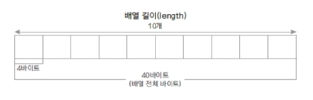

### 연결리스트 (LinkedList)
선형으로 자료를 관리, 자료가 추가될 때마다 메모리를 할당 받고 자료는 링크로 연결됩니다. 자료의 물리적 위치와 논리적 위치가 다를 수 있습니다.<br />
몇 번째 항을 찾을때 무조건 맨 처음부터 찾아야하기 때문에 걸리는 시간이 오래 걸립니다. <br />
자료를 조정하는데에 걸리는 시간은 적지만 위치를 찾는데에 소요되는 시간은 더 많이 걸립니다.

- 리스트에 자료 추가하기
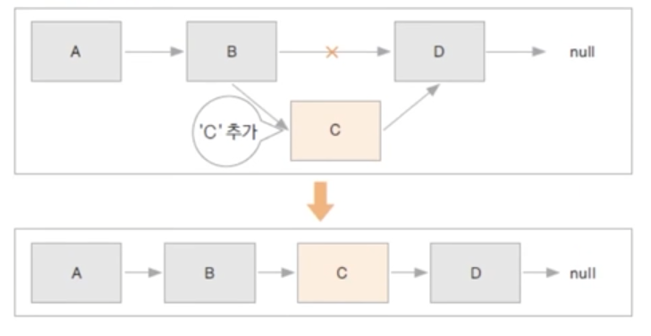

- 리스트에 자료 삭제하기
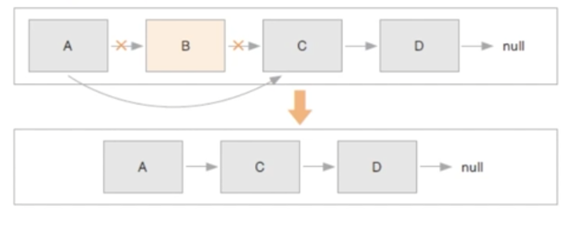

### 스택(Stack)
가장 나중에 입력된 자료가 가장 먼저 출력되는 자료구조 (Last In First Out - LIFO)
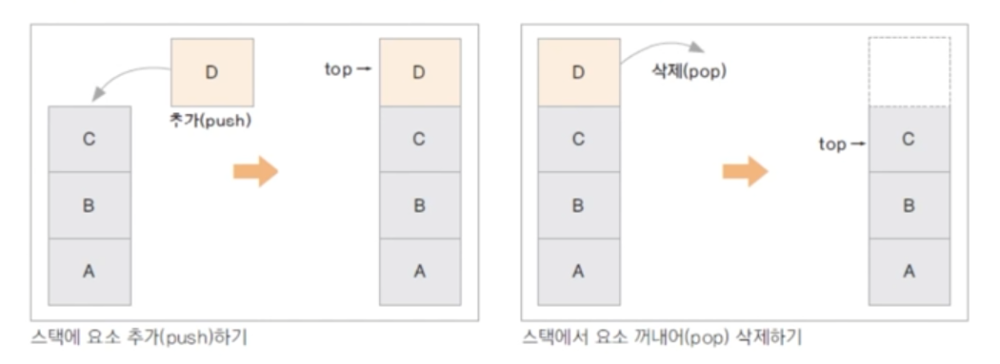

### 큐(Queue)
가장 먼저 입력된 자료가 가장 먼저 출력되는 자료구조(First In First Out - FIFO)
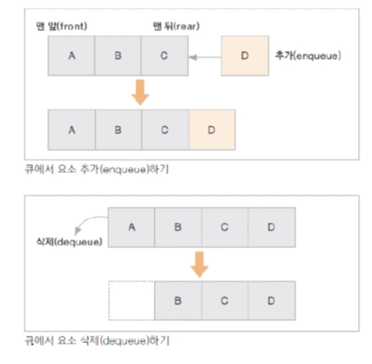


- **비선형 자료구조**
### 트리 (Tree)
부모 노드와 자식 노드간의 연결로 이루어진 자료구조
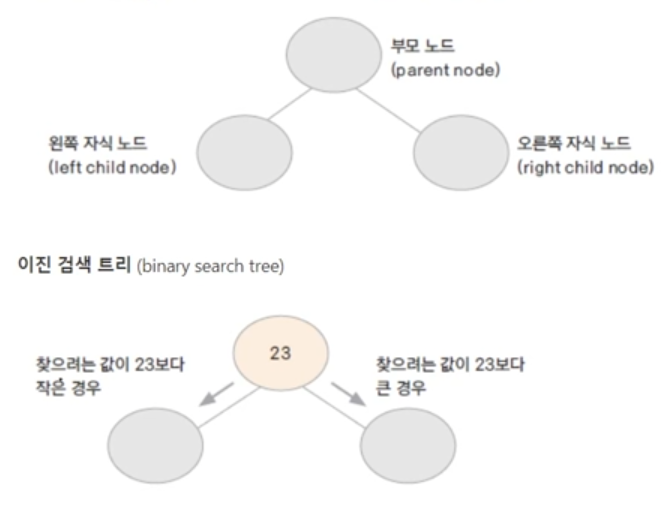

### 힙 (Heap)
Priority queue를 구현 (우선순위 큐)
- Max heap : 부모 노드는 자식 노드보다 항상 크거나 같은 값을 갖는 경우
- Min heap : 부모 노드는 자식 노드보다 항상 작거나 같은 값을 갖는 경우
- heap 정렬에 활용할 수 있습니다.

### 이진 트리(Binary Tree)
부모 노드에 자식 노드가 두 개 이하인 트리
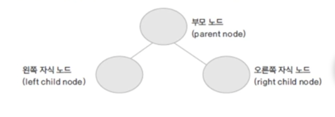

### 이진 검색 트리 (Binary Search Tree)
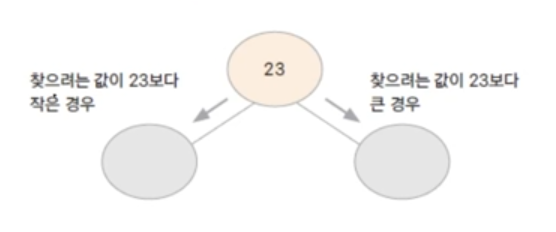

```textarea
자료(key)의 중복을 허용하지 않습니다. (key는 유일한 값)
왼쪽 자식 노드는 부모 노드보다 작은 값, 오른쪽 자식 노드는 부모 노드모다 큰 값을 가집니다.
자료 검색에 걸리는 시간이 평균 log(n)입니다.
inorder traversal 탐색을 하게 되면 자료가 정렬되어 출력됩니다.
```

- 예) 23, 10, 28, 15, 7, 22, 56 순으로 자료를 넣을 때
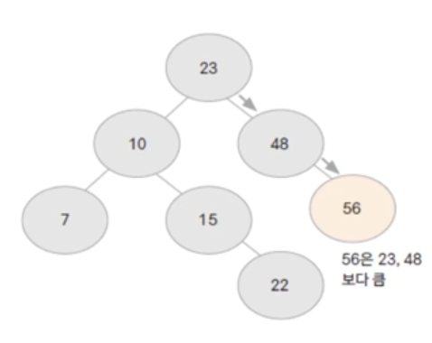

jdk 클래스 : TreeSet, TreeMap (Tree로 시작되는 클래스는 정렬을 지원합니다.)

### 그래프 (Graph)
- 정점과 간선들의 유한 집합 G = (V, E)
- 정점(vertex) : 여러 특성을 가지는 객체, 노드(node)
- 간선(edge): 이 객체들을 연결 관계를 나타냅니다. 링크(Link)
- 간선은 방향성이 있는 경우와 없는 경우가 있습니다.
- 그래프를 구현하는 방법 : 인접 행렬(adjacency matrix), 인접 리스트(adjacency list)
- 그래프를 탐색하는 방법 : BFS(Bread First Search), DFS(Depth First Search)
- 그래프의 예)
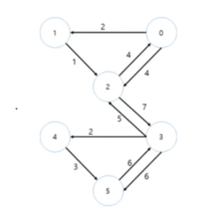

### 해싱 (Hashing)
- 자료를 검색하기 위한 자료 구조
- 키(key)에 대한 자료를 검색하기 위한 사전(dictionary)개념의 자료 구조
- key는 유일하고 이에 대한 value를 쌍으로 저장합니다.
- index = h(key): 해시 함수가 key에 대한 인덱스를 반환해주면 해당 인덱스 위치에 자료를 저장하거나 검색하게 됩니다. 
- 해시 함수에 의해 인덱스 연산이 산술적으로 가능합니다. O(1)
- 저장되는 메모리 구조를 해시 테이블이라 합니다.

jdk클래스: HashMap, Properties

### 해시 테이블
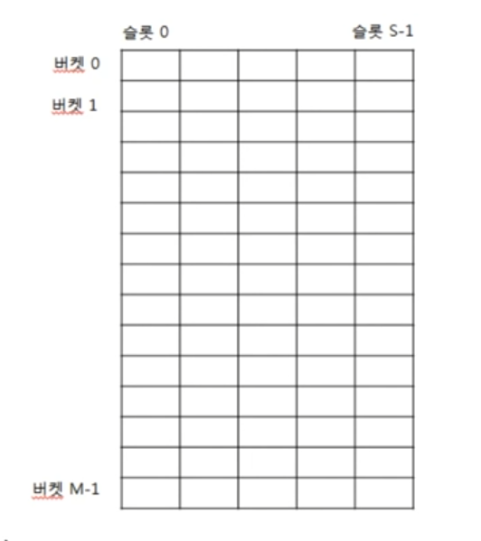


### 체이닝
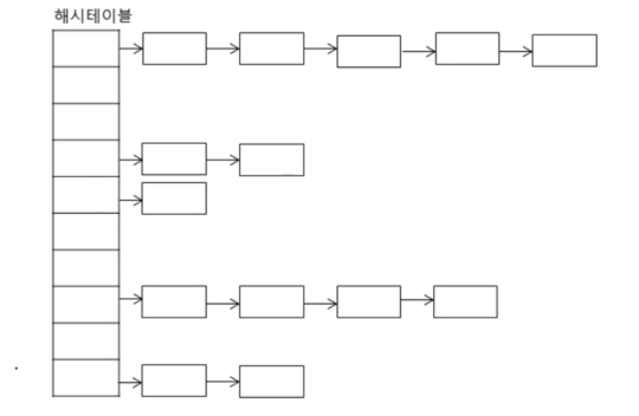

# 배열 구현하기
## 배열의 특징
- 동일한 데이터 타입을 순서에 따라 관리하는 자료 구조입니다.
- 정해진 크기가 있습니다.
- 요소의 추가와 제거시 다른 요소들의 이동이 필요합니다.
- 배열의 i번째 요소를 찾는 인덱스 연산이 빠릅니다.
- jdk클래스 : ArrayList, Vector

## 배열 구현
### MyArray.java
```java
public class MyArray {
	int[] intArr;
	int count; // 개수
	
	public int ARRAY_SIZE;
	public static final int ERROR_NUM = -9999999;
	
	public MyArray() {
		count = 0;
		ARRAY_SIZE = 10;
		intArr = new int[ARRAY_SIZE];
	}
	
	public MyArray(int size) {
		count = 0;
		ARRAY_SIZE = size;
		intArr = new int[size];
	}
	
	public void addElement(int num) {
		if(count >= ARRAY_SIZE) {
			System.out.println("not enough memory");
			return;
		}
		intArr[count++] = num;
	}
	
	public void insertElement(int position, int num) {
		// 이동의 수는 요소의 개수에 비례하게 됨.
		// 개수는 고려하지 않는다. 차수만 고려한다.
		
		int i;
		
		if(position < 0 || position > count) {
			return;
		}
		
		if (count >= ARRAY_SIZE) {
			return;
		}
		
		for(i = count-1; i >= position; i--) {
			intArr[i+1] = intArr[i];
		}
		
		intArr[position] = num;
		count++;
	}
	
	public int removeElement(int position) {
		int ret = ERROR_NUM;
		
		if(isEmpty()) {
			System.out.println("Array is empty");
			return ret;
		}
		if(position < 0 || position > count - 1) {
			return ret;
		}
		
		ret = intArr[position];
		
		for(int i = position; i < count - 1; i++) {
			intArr[i] = intArr[i+1];
		}
		count--;
		
		return ret;
	}
	
	public int getSize() {
		return count;
	}
	
	public boolean isEmpty() {
		if(count == 0) {
			return true;
		}
		else return false;
	}
	
	public int getElement(int position)
	{
		if(position < 0 || position > count-1){
			System.out.println("검색 위치 오류. 현재 리스트의 개수는 " + count +"개 입니다.");
			return ERROR_NUM;
		}
		return intArr[position];
	}
	
	public void printAll()
	{
		if(count == 0){
			System.out.println("출력할 내용이 없습니다.");
			return;
		}
			
		for(int i=0; i<count; i++){
			System.out.println(intArr[i]);
		}
		
	}
	
	public void removeAll()
	{
		for(int i=0; i<count; i++){
			intArr[i] = 0;
		}
		count = 0;
	}
}
```

### MyArrayTest.java
```java
public class MyArrayTest {

	public static void main(String[] args) {
		MyArray array = new MyArray();
		array.addElement(10);
		array.addElement(20);
		array.addElement(30);
		array.insertElement(1, 50);
		array.printAll();
		
		System.out.println("===============");
		array.removeElement(1);
		array.printAll();
		System.out.println("===============");
			
		array.addElement(70);
		array.printAll();
		System.out.println("===============");
		array.removeElement(1);
		array.printAll();
		
		System.out.println("===============");
		System.out.println(array.getElement(2));
	}

}
```

### 출력결과
```console
10
50
20
30
===============
10
20
30
===============
10
20
30
70
===============
10
30
70
===============
70
```

# 연결리스트(LinkedList) 구현하기
## 연결리스트 특징
- 동일한 데이터 타입을 순서에 따라 관리하는 자료구조입니다.
- 자료를 저장하는 노드에는 자료와 다음 요소를 가리키는 링크(포인터)가 있습니다.
- 자료가 추가될 때 노드 만큼의 메모리를 할당 받고 이전 노드의 링크로 연결합니다.(정해진 크기가 없습니다.)
- 연결 리스트의 i번째 요소를 찾는데 걸리는 시간은 요소의 개수에 비례합니다. (O(n))
- jdk 클래스 : LinkedList

## 연결리스트 구현
### MyListNode.java
```java
public class MyListNode {

	private String data; // 자료
	public MyListNode next; // 다음 노드를 가리키는 링크
	
	public MyListNode() {
		data = null;
		next = null;
	}
	
	public MyListNode(String data) {
		this.data = data;
		this.next = null;
	}
	
	public MyListNode(String data, MyListNode link) {
		this.data = data;
		this.next = link;
	}
	
	public String getData() {
		return data;
	}
}
```

### MyLinkedList.java
```java
public class MyLinkedList {

	private MyListNode head;
	int count;
	
	public MyLinkedList() {
		head = null;
		count = 0;
	}
	
	public MyListNode addElement( String data ) {
		
		MyListNode newNode;
		if(head == null) { //맨 처음일때
			newNode = new MyListNode(data);
			head = newNode;
		}
		else {
			newNode = new MyListNode(data);
			MyListNode temp = head;
			while(temp.next != null) {
				//맨 뒤로 가서
				temp = temp.next;
			}
			temp.next = newNode;
		}
		count++;
		return newNode;
	}
	
	public MyListNode insertElement(int position, String data ) {
		int i;
		MyListNode tempNode = head;
		MyListNode newNode = new MyListNode(data);
		
		if(position < 0 || position > count ) {
			System.out.println("추가 할 위치 오류 입니다. 현재 리스트의 개수는 " + count +"개 입니다.");
			return null;
		}
		
		if(position == 0) {  //맨 앞으로 들어가는 경우
			newNode.next = head;
			head = newNode;
		}
		else{
			MyListNode preNode = null;	
			for(i = 0; i < position; i++){
				preNode = tempNode;
				tempNode = tempNode.next;
			}
			newNode.next = preNode.next;
			preNode.next = newNode;
		}
		count++;
		return newNode;
	}
	
	public MyListNode removeElement(int position) {
		int i;
		MyListNode tempNode = head;
		
		if(position >= count) {
			System.out.println("삭제 할 위치 오류입니다. 현재 리스트의 개수는 " + count + "개 입니다.");
			return null;
		}
		
		if(position == 0){ //맨 앞을 삭제
			head = tempNode.next;
		}
		else{
			MyListNode preNode = null;	
			for(i = 0; i < position; i++) {
				preNode = tempNode;
				tempNode = tempNode.next;
			}
			preNode.next = tempNode.next;
		}
		count--;
		System.out.println(position + "번째 항목 삭제되었습니다.");
		
		return tempNode;
	}
	
	public String getElement(int position) {
		int i;
		MyListNode tempNode = head;
		
		if(position >= count) {
			System.out.println("검색 위치 오류 입니다. 현재 리스트의 개수는 " + count +"개 입니다.");
			return new String("error");
		}
		
		if(position == 0) { //맨 인 경우

			return head.getData();
		}
		
		for(i = 0; i < position; i++) {
			tempNode = tempNode.next;
			
		}
		return tempNode.getData();
	}

	public MyListNode getNode(int position) {
		int i;
		MyListNode tempNode = head;
		
		if(position >= count) {
			System.out.println("검색 위치 오류 입니다. 현재 리스트의 개수는 " + count +"개 입니다.");
			return null;
		}
		
		if(position == 0) {  //맨 인 경우

			return head;
		}
		
		for(i = 0; i < position; i++){
			tempNode = tempNode.next;
		}
		return tempNode;
	}

	public void removeAll() {
		head = null;
		count = 0;
		
	}
	
	public int getSize() {
		return count;
	}
	
	public void printAll() {
		if(count == 0) {
			System.out.println("출력할 내용이 없습니다.");
			return;
		}
		
		MyListNode temp = head;
		while(temp != null) {
			System.out.print(temp.getData());
			temp = temp.next;
			if(temp != null) {
				System.out.print("->");
			}
		}
		System.out.println("");
	}
	
	public boolean isEmpty() {
		if(head == null) {
			return true;
		}
		else {
			return false;
		}
	}
	
}
```

### MyLinkedListTest.java
```java
public class MyLinkedListTest {

	public static void main(String[] args) {

		MyLinkedList list = new MyLinkedList();
		list.addElement("A");
		list.addElement("B");
		list.addElement("C");
		list.printAll();
		list.insertElement(3, "D");
		list.printAll();
		list.removeElement(0);
		list.printAll();
		list.removeElement(1);
		list.printAll();
						
		list.insertElement(0, "A-1");
		list.printAll();
		System.out.println(list.getSize());
		
		list.removeElement(0);
		list.printAll();
		System.out.println(list.getSize());
		
		list.removeAll();
		list.printAll();
		list.addElement("A");
		list.printAll();
		System.out.println(list.getElement(0));
		list.removeElement(0);
	}
}
```

# 스택(Stack) 구현하기
## Stack의 특징
- 맨 마지막의 위치(top)에서만 자료를 추가, 삭제, 꺼내올 수 있습니다. (중간의 자료를 꺼낼 수 없습니다.)
- Last In First Out (후입선출)구조입니다.
- 택배상자가 쌓여 있는 모양이라고 생각하면 이해하기 쉽습니다.
- 가장 최근의 자료를 찾아오거나 게임에서 히스토리를 유지하고 이르 무를때 사용할 수 있습니다.
- 함수의 메모리는 호출 순서에 따른 stack구조입니다.
- jdk 클래스: Stack

## 배열을 활용하여 Stack 구현하기
### MyArrayStack.java
```java
import ch37.MyArray;

public class MyArrayStack {
	MyArray arrayStack;
	int top;
	
	public MyArrayStack() {
		top = 0;
		arrayStack = new MyArray();
	}
	
	public MyArrayStack(int size) {
		top = 0;
		arrayStack = new MyArray(size);
	}
	
	public void push(int data) {
		// 배열일 경우는 꽉 찼는지 확인을 해야한다.
		if(isFull()) {
			System.out.println("Stack is Full");
			return;
		}
		arrayStack.addElement(data);
		top++;
	}
	
	public int pop() {
		if(isEmpty()) { // 데이터가 비어있을 경우
			System.out.println("Stack is Empty");
			return MyArray.ERROR_NUM;
		}
		return arrayStack.removeElement(--top);
	}
	
	public int peek() {
		if(isEmpty()) { // 데이터가 비어있을 경우
			System.out.println("Stack is Empty");
			return MyArray.ERROR_NUM;
		}
		return arrayStack.getElement(--top);
	}
	
	public boolean isFull() {
		if(top == arrayStack.ARRAY_SIZE) {
			return true;
		}
		else return false;
	}
	
	public boolean isEmpty() {
		if(top == 0) {
			return true;
		}
		else return false;
	}
	
	public void printAll() {
		arrayStack.printAll();
	}
}
```

### MyArrayStackTest.java
```java
public class MyArrayStackTest {

	public static void main(String[] args) {
		MyArrayStack stack = new MyArrayStack(3);
		stack.push(10);
		stack.push(20);
		stack.push(30);
		stack.push(40);
		
		stack.printAll();
		
		System.out.println("==========");
		System.out.println(stack.pop());
		System.out.println(stack.pop());
		
		System.out.println("==========");
		System.out.println(stack.peek());
	}

}
```

### 출력 결과
```console
Stack is Full
10
20
30
==========
30
20
==========
10
```

# 큐(Queue) 구현하기
## Queue의 특징
- 맨 앞(front)에서 자료를 꺼내거나 삭제하고 맨 뒤(rear)에서 자료를 추가합니다.
- First In First Out (선입선출)구조입니다.
- 일상 생활에서 일렬로 줄 서 있는 모양을 생각하면 이해하기 쉽습니다.
- 순차적으로 입력된 자료를 순서대로 처리하는데 많이 사용되는 자료구조입니다.
- 콜센터에 들어온 문의 전화, 메세지 큐 등에 활용됩니다.
- jdk 클래스: ArrayList

## 연결리스트를 활용하여 Queue 구현하기
### MyLinkedQueue.java
```java
import ch38.MyLinkedList;
import ch38.MyListNode;

interface Queue {
	public void enQueue(String data);
	public String deQueue();
	public void printQueue();
}

public class MyLinkedQueue extends MyLinkedList implements Queue {

	MyListNode front;
	MyListNode rear;
	
	@Override
	public void enQueue(String data) {
		MyListNode newNode;
		if(isEmpty()) {
			// 비어있는 큐에 맨 처읆으로 들어가는 경우
			newNode = addElement(data);
			front = newNode;
			rear = newNode;
		}
		else {
			// 맨 뒤로 들어가는 경우
			newNode = addElement(data);
			rear = newNode;
		}
		
		System.out.println(newNode.getData() + " added");
	}

	@Override
	public String deQueue() {
		if(isEmpty()) {
			return null;
		}
		String data = front.getData();
		front = front.next;
		
		if(front == null) { // 마지막 항목이라는 의미
			rear = null;
		}
		return data;
	}

	@Override
	public void printQueue() {
		printAll();
	}

}
```

### MyListQueueTest.java
```java
public class MyListQueueTest {

	public static void main(String[] args) {
		MyLinkedQueue listQueue = new MyLinkedQueue();
		listQueue.enQueue("A");
		listQueue.enQueue("B");
		listQueue.enQueue("C");
		
		listQueue.printAll();
		
		System.out.println(listQueue.deQueue());
		System.out.println(listQueue.deQueue());
	}

}
```

### 출력 결과
```console
Aadded
Badded
Cadded
A->B->C
A
B
```

# 무엇이든 담을 수 있는 제네릭(Generic) 프로그래밍
## 제네릭 자료형 정의
- 클래스에서 사용하는 변수의 자료형이 여러개일 수 있고, 그 기능(메서드)은 동일한 경우 클래스의 자료형을 특정하지 않고 추후 해당 클래스를 사용할 때 지정할 수 있도록 선언합니다.
- 실제 사용되는 자료형의 변환은 컴파일러에 의해 검증되므로 안정적인 프로그래밍 방식입니다.
- 컬렉션 프레임워크에서 많이 사용되고 있습니다.
- 제네릭 타입을 사용하지 않는 경우의 예

### 재료가 Powder인 경우
```java
public class ThreeDPrinter1 {
	private Powder material;
	
	public void setMeterial(Powder material) {
		this.material = material;
	}
	
	public Powder getMaterial() {
		return material;
	}
}
```

### 재료가 Plastic인 경우
```java
public class ThreeDPrinter2 { // 클래스에 1, 2같은 숫자 사용하는거 별로 좋은거 아니지만 이것은 예제여서 상관 x
	private Plastic material;
	
	public void setMeterial(Plastic material) {
		this.material = material;
	}
	
	public Plastic getMaterial() {
		return material;
	}
}
```

### 여러타입을 대체하기 위해 Object를 사용할 수 있습니다.
```java
public class ThreeDPrinter3 { // 클래스에 1, 2같은 숫자 사용하는거 별로 좋은거 아니지만 이것은 예제여서 상관 x
	// 이 printer는 재료가 뭐든지 다 적용
	
	private Object material;
	
	public void setMeterial(Object material) {
		this.material = material;
	}
	
	public Object getMaterial() {
		return material;
	}
}
```

### Object를 사용하는 경우 형 변환을 해줘야 합니다.
```java
Powder powder = new Powder();
		ThreeDPrinter3 printer = new ThreeDPrinter3();
		
		printer.setMeterial(powder);
		
		Powder p = (Powder)printer.getMaterial(); // 이때 반환되는 값이 Object이기 때문에 앞에 (Powder)를 써줘서 형변환을 해야한다.
```

### GenericPrinter.java
```java
public class GenericPrinter<T> { // T자리에 실제적으로 사용할 자료형을 쓴다. 나중에 쓸 때
	private T material;
	
	public void setMeterial(T material) {
		this.material = material;
	}
	
	public T getMaterial() {
		return material;
	}
	
	public String toString() {
		return material.toString();
	}
}
```
- 자료형 매개변수 T(Type Parameter): 이 클래스를 사용하는 시점에 실제 사용할 자료형을 지정, static 변수는 사용할 수 없습니다.
- GenericPrinter: 제네릭 자료형
- E: element, K: key, V: value 등 여러 알파벳을 의미에 따라 사용 가능합니다.

## 제네릭 클래스 사용하기
### Powder.java
```java
public class Powder {
	public String toString() {
		return "재료는 Powder 입니다.";
	}
}
```

### Plastic.java
```java
public class Plastic {
	public String toString() {
		return "재료는 Plastic 입니다.";
	}
}
```

### GenericPrinter.java
```java
public class GenericPrinter<T> {  // T자리에 실제적으로 사용할 자료형을 쓴다. 나중에 쓸 때
	private T material;
	
	public void setMeterial(T material) {
		this.material = material;
	}
	
	public T getMaterial() {
		return material;
	}
	
	public String toString() {
		return material.toString();
	}
}
```

### GenericPrinterTest.java
```java
public class GenericPrinterTest {

	public static void main(String[] args) {
		Powder powder = new Powder();
		
		GenericPrinter<Powder> powderPrinter = new GenericPrinter<>(); // <> : 다이아몬드 연산자
		powderPrinter.setMeterial(powder);
		
		Powder p = powderPrinter.getMaterial(); // 형변환을 하지 않는다.
		// 형변환을 하지 않는 이유 : GenericPrinter<Powder>이렇게 작성하면 컴파일될 때 GenericPrinter 클래스에 있는 모든 T가 Powder로 바뀜.
		
		System.out.println(powderPrinter.toString());
		
	}

}
```

### 출력 결과
```console
재료는 Powder 입니다.
```

## 다이아몬드 연산자 - <>
- ArrayList list = new ArrayList<>(); // 다이아몬드 연산자 내부에서 자료형은 생략가능 합니다.
- 제네릭에서 자료형 추론(자바 10부터)

```java
ArrayList list = new ArrayList<>() => var list = new ArrayList()
```

# <T extends 클래스> 사용하기
## 상위 클래스의 필요성
- T자료형의 범위를 제한할 수 있습니다.
- 상위 클래스에서 선언하거나 정의하는 메서드를 활용할 수 있습니다.
- 상속을 받지 않는 경우 T는 Object로 변환되어 Object 클래스가 기본으로 제공하는 메서드만 사용 가능합니다.

## T extends를 사용한 프로그래밍
- GenericPrinter에 material 변수의 자료형을 상속받아 구현합니다.
- 전의 예제에서 어떤 재료를 넣어도 다 출력이 되는 형식이였는데 이렇게되면 물과 같은 재료를 넣어도 정상작동이 됩니다.
- 그렇기 때문에 T에 무작위 클래스가 들어갈 수 없게 Material 클래스를 상속받은 클래스로 한정합니다.

### Material.java
```java
public abstract class Material { // 직접 쓸일은 없기 때문에 abstract로 만듭니다.
	/*
	 * T가 사용할 여러 메서드들을 추상클래스 상위 클래스에서 미리선언을 해놓고
	 * 이것을 구현하도록 할 수도 있고 공통되는 기능을 구현해 놓을 수도 있다.
	 * extends T를 사용함으로써 써야하는 재료에 대해서 한정을 두고
	 * 어떤 클래스 기반에 한 것만 넣을 수 있다는 제약도 있다.
	 */
	
	public abstract void doPrinting();
}
```

### Powder.java
```java
public class Powder extends Material {
	public String toString() {
		return "재료는 Powder 입니다.";
	}

	@Override
	public void doPrinting() {
		System.out.println("Powder 재료로 출력합니다.");
	}
}
```

### Plastic.java
```java
public class Plastic extends Material {
	public String toString() {
		return "재료는 Plastic 입니다.";
	}

	@Override
	public void doPrinting() {
		System.out.println("Plastic 재료로 출력합니다.");
	}
}
```

# 제네릭 메서드 활용하기
## 제네릭 메서드란?
- 자료형 매개변수를 메서드의 매개변수나 반환 값으로 가지는 메서드입니다.
- 자료형 매개변수가 하나 이상인 경우도 있습니다.
- 제네릭 클래스가 아니어도 내부에 제네릭 메서드는 구현하여 사용할 수 있습니다.
- public <자료형 매개 변수> 반환형 메서드 이름(자료형 매개벼수 ...) {}

## 제네릭 메서드의 활용 예
- 두 점(top, bottom)을 기준으로 사각형을 만들 때 사각형의 너비를 구하는 메서드
- 두 점은 정수인 경우도 있고, 실수인 경우도 있으므로 제네릭 타입을 사용하여 구현합니다.

### Point.java
```java
public class Point<T, V> {
	T x;
	V y;
	
	Point(T x, V y) {
		this.x = x;
		this.y = y;
	}
	
	public T getX() {
		return x;
	}
	
	public V getY() {
		return y;
	}
}
```

### GenericMethod.java
```java
public class GenericMethod {
	
	public static <T, V> double makeRectangle(Point<T, V> p1, Point<T, V> p2) {
		double left = ((Number)p1.getX()).doubleValue();
		double right = ((Number)p2.getX()).doubleValue();
		double top = ((Number)p1.getY()).doubleValue();
		double bottom = ((Number)p2.getY()).doubleValue();
		
		double width = right - left;
		double height = bottom - top;
		
		return width * height;
	}

	public static void main(String[] args) {
		Point<Integer, Double> p1 = new Point<Integer, Double>(0, 0.0);
		Point<Integer, Double> p2 = new Point<>(10, 10.0); // <>안에 생략가능
		
		double size = GenericMethod.<Integer, Double>makeRectangle(p1, p2);
		
		System.out.println(size);
	}

}
```

### 출력 결과
```console
100.0
```

# 자바에서 제공되는 자료구조 구현 클래스들 - 컬렉션 프레임워크
## 컬렉션 프레임워크
- 프로그램 구현에 필요한 자료구조를 구현해 놓은 JDK라이브러리
- java.util 패키지에 구현되어 있습니다.
- 개발에 소요되는 시간을 절약하면서 최적화 된 알고리즘을 사용할 수 있습니다.
- 여러 구현 클래스와 인터페이스의 활용에 대한 이해가 필요합니다.

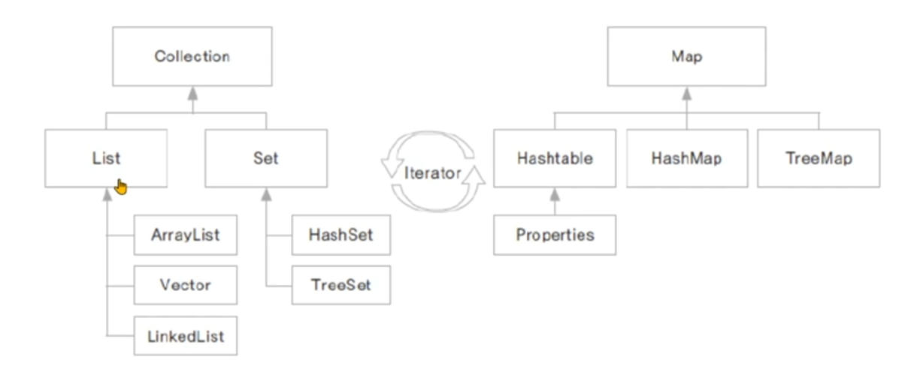

## Collection Interface
- 하나의 객체를 관리하기 위한 메서드가 선언된 인터페이스
- 하위에 List와 Set 인터페이스가 있습니다.

### List Interface
- 객체를 순서에 따라 저장하고 관리하는데 필요한 메서드가 선언된 인터페이스
- 자료구조 리스트(배열, 연결리스트)의 구현을 위한 인터페이스
- 중복을 허용합니다.
- ArrayList, Vector, LinkedList, Stack, Queue, ...

### Set Interface
- 순서와 관계없이 중복을 허용하지 않고 유일한 값을 관리하는데 필요한 메서드가 선언됩니다.
- 아이디, 주민번호, 사번등을 관리하는데 유용합니다.
- 저장된 순서와 출력되는 순서는 다를 수 있습니다.
- HashSet, TreeSet, ...

## Map Interface
- 쌍(pair)으로 이루어진 객체를 관리하는데 사용하는 메서드들이 선언된 인터페이스
- 객체는 key-value의 쌍으로 이루어집니다.
- key는 중복을 허용하지 않습니다.
- HashTable, HashMap, Properties, TreeMap 등이 Map 인터페이스를 구현합니다. 

# 순차적으로 자료를 관리하는 List 인터페이스를 구현한 클래스와 그 활용
## 멤버쉽 관리하기
- Member 클래스를 만들고, 아이디와 이름을 멤버 변수로 선언합니다.
- Member 클래스로 생성된 인스턴스들을 관리하는 클래스를 컬렉션 프레임워크 클래스들을 활용하여 구현합니다.

## ArrayList 활용하기
- 멤버를 순차적으로 관리합니다.

### Member.java
```java
public class Member {
	private int memberId;
	private String memberName;
	
	public Member(int memberId, String memberName) {
		this.memberId = memberId;
		this.memberName = memberName;
	}

	public int getMemberId() {
		return memberId;
	}

	public void setMemberId(int memberId) {
		this.memberId = memberId;
	}

	public String getMemberName() {
		return memberName;
	}

	public void setMemberName(String memberName) {
		this.memberName = memberName;
	}

	@Override
	public String toString() {
		return memberName + " 회원님의 아이디는 " + memberId + "입니다.";
	}
}
```

### MemberArrayList.java
```java
import java.util.ArrayList;

public class MemberArrayList {
	private ArrayList<Member> arrayList;
	
	public MemberArrayList() {
		arrayList = new ArrayList<>();
	}
	
	public MemberArrayList(int size) {
		arrayList = new ArrayList<>(size);
	}
	
	public void addMember(Member member) {
		arrayList.add(member);
	}
	
	public boolean removeMember(int memberId) {
		for(int i = 0; i < arrayList.size(); i++) {
			Member member = arrayList.get(i);
			
			int tempId = member.getMemberId();
			
			if(tempId == memberId) {
				arrayList.remove(i);
				return true;
			}
		}
		
		System.out.println(memberId + "가 존재하지 않습니다.");
		return false;
	}
	
	public void showAllMember() {
		for(Member member : arrayList) {
			System.out.println(member);
		}
		System.out.println();
	}
}
```

### MemberArrayListTest.java
```java
public class MemberArrayListTest {

	public static void main(String[] args) {
		MemberArrayList memberArrayList = new MemberArrayList();
		
		Member memberLim = new Member(1001, "Lim");
		Member memberLee = new Member(1002, "Lee");
		Member memberWoo = new Member(1003, "Woo");
		Member memberKim = new Member(1004, "Kim");
		
		memberArrayList.addMember(memberLim);
		memberArrayList.addMember(memberLee);
		memberArrayList.addMember(memberWoo);
		memberArrayList.addMember(memberKim);
		
		memberArrayList.showAllMember();
		memberArrayList.removeMember(memberKim.getMemberId());
		memberArrayList.showAllMember();
		
	}

}
```

### 출력 결과
```console
Lim 회원님의 아이디는 1001입니다.
Lee 회원님의 아이디는 1002입니다.
Woo 회원님의 아이디는 1003입니다.
Kim 회원님의 아이디는 1004입니다.

Lim 회원님의 아이디는 1001입니다.
Lee 회원님의 아이디는 1002입니다.
Woo 회원님의 아이디는 1003입니다.
```

